# Project Cockpit: Implementation Plan

> **For agentic workers:** REQUIRED SUB-SKILL: Use superpowers:subagent-driven-development (recommended) or superpowers:executing-plans to implement this plan task-by-task. Steps use checkbox (`- [ ]`) syntax for tracking.

**Goal:** Tạo 17 skill definition files (10 SKILL.md + 1 flows.md + 6 reference files) cho hệ thống Project Cockpit, hợp nhất OKR + Knowledge Engine thành 11 pk-* skill.

**Architecture:** Mỗi skill là 1 thư mục chứa SKILL.md (YAML frontmatter + markdown body). pk-shared chứa 6 reference files canonical. pk-harness có thêm flows.md. Tất cả skill follow format đã thiết lập bởi hệ thống okr-*/knowhow-* hiện có: frontmatter (name, description), title, overview, modes, SOT, nguyên tắc, flow, quy tắc cứng.

**Tech Stack:** Markdown skill files, YAML frontmatter, Mermaid diagrams (flows.md)

**Spec:** `docs/superpowers/specs/2026-06-10-project-cockpit-design.md`

**Target directory:** `skills/pk-*/` (relative to project root)

**Existing skills reference (read-only, DO NOT modify):**
- OKR: `/Users/tuanhv/.agents/skills/okr-*/`
- Knowledge: `/Users/tuanhv/Desktop/shun_claude_tools/knowledge-engine/skills/knowhow-*/`

---

## File Structure

```
skills/
├── pk-shared/
│   └── references/
│       ├── snapshot-contract.md
│       ├── sot-ownership.md
│       ├── cross-call-rules.md
│       ├── quality-gate.md
│       ├── metrics.md
│       └── schemas.md
├── pk-init/
│   └── SKILL.md
├── pk-analyze/
│   └── SKILL.md
├── pk-plan/
│   └── SKILL.md
├── pk-track/
│   └── SKILL.md
├── pk-capture/
│   └── SKILL.md
├── pk-reflect/
│   └── SKILL.md
├── pk-distill/
│   └── SKILL.md
├── pk-consult/
│   └── SKILL.md
├── pk-lint/
│   └── SKILL.md
├── pk-harness/
│   ├── SKILL.md
│   └── references/
│       └── flows.md
```

---

### Task 1: Setup + pk-shared foundation (snapshot-contract, sot-ownership, cross-call-rules)

**Files:**
- Create: `skills/pk-shared/references/snapshot-contract.md`
- Create: `skills/pk-shared/references/sot-ownership.md`
- Create: `skills/pk-shared/references/cross-call-rules.md`

- [ ] **Step 1: Create directory structure**

```bash
mkdir -p skills/pk-shared/references
mkdir -p skills/pk-init
mkdir -p skills/pk-analyze
mkdir -p skills/pk-plan
mkdir -p skills/pk-track
mkdir -p skills/pk-capture
mkdir -p skills/pk-reflect
mkdir -p skills/pk-distill
mkdir -p skills/pk-consult
mkdir -p skills/pk-lint
mkdir -p skills/pk-harness/references
```

- [ ] **Step 2: Write snapshot-contract.md**

```markdown
# Preload Contract: Context Snapshot duy nhất

Canonical. Định nghĩa context snapshot MỌI skill pk-* đều đọc ở đầu flow. Maintain 1 chỗ duy nhất.

**Vấn đề giải quyết**: khi gọi skill lẻ (`/pk-track`, `/pk-plan`...) KHÔNG qua `pk-harness`, skill thiếu snapshot mà orchestrator đáng lẽ làm. Contract bảo đảm: mọi entry point đều nạp đủ nền.

## Nguyên tắc idempotent (không đọc trùng)

Chỉ nạp cái **chưa có** trong context.

- Chạy QUA `pk-harness`: orchestrator Phase 1 đã snapshot. Skill KHÔNG đọc lại.
- Chạy LẺ (không qua harness): skill tự nạp phần thiếu, một lần, ở đầu flow.

Trước khi nạp: kiểm tra `.cockpit/` tồn tại. Không có → route `pk-init` (không nạp gì thêm).

## Context Snapshot (1 bản duy nhất)

**Bước 0 (bắt buộc):** `ls -1 .cockpit/` (cấp 1, KHÔNG đệ quy). Phát hiện cấu trúc + anomalies.

| Nguồn | Độ sâu nạp | Dùng để |
| --- | --- | --- |
| `objective.md` | Frontmatter: `type`, `status`, `period`, KR/KI IDs, constraints tóm tắt | Route, chọn metrics, guard paused |
| `tools.md` | **TOÀN BỘ body** | Inventory công cụ, auto-load concept pages khi match |
| `plan.md` | Frontmatter + counters | Có/không plan, done rate |
| `actions/*.md` | Scan frontmatter | Count by status, active IDs |
| `inbox/*.md` | Scan frontmatter `status: pending` | Count by domain |
| `knowledge/index.md` | **TOÀN BỘ** | Registry tri thức + usage count |
| `skills/registry.md` | **TOÀN BỘ** | Registry skills |
| `workflows/registry.md` | **TOÀN BỘ** | Registry workflows |
| Pinned pages | **Full body** | Pages có `pinned: true` trong frontmatter |

## KHÔNG preload (on-demand)

| Nguồn | Ai đọc, khi nào |
| --- | --- |
| `objective.md` body (bảng KR/KI) | `pk-analyze` khi tính metrics |
| `plan.md` body (Roadmap) | `pk-track` re-render, `pk-plan` update |
| `actions/*.md` body | `pk-track` khi update |
| `knowledge/*.md` body | `pk-consult` khi query, `pk-distill` khi xử lý |
| `skills/*.md` body | `pk-consult` mode run |
| `workflows/*.md` body | `pk-consult` mode run |
| `log/**` | `pk-track` deep, `pk-analyze` deep |
| `archive/**` | `pk-lint` restore, `pk-analyze` audit |
| `raw/**` | `pk-capture` provenance |

## Áp dụng tri thức (không chỉ load cho có)

`knowledge/index.md` đã nạp → dùng làm **context định hướng**. Trước khi đề xuất/ghi: đối chiếu knowledge page có nội dung liên quan việc đang làm. Cần detail → đọc body page tương ứng.

## Auto-load concept pages từ tools.md

Khi skill phát hiện keyword match giữa task hiện tại và tool/concept trong snapshot → tự load concept page chi tiết từ `knowledge/`. An toàn vì read-only.

## Reachability khi ghi (chống file mồ côi)

Mọi file trong `.cockpit/` phải reachable từ SOT:

| Loại file | Neo vào |
| --- | --- |
| Action | `actions/` + Roadmap link trong `plan.md` |
| Knowledge page | `knowledge/index.md` entry |
| Skill | `skills/registry.md` entry |
| Workflow | `workflows/registry.md` entry |
| Inbox item | `inbox/` (thư mục cấu trúc) |
| Log entry | `log/` (thư mục cấu trúc) |
| Raw source | `raw/` (thư mục cấu trúc) |

## Graceful Degradation

| Tình trạng | Hành vi |
| --- | --- |
| Không có `.cockpit/` | pk-harness route sang pk-init |
| Có `.cockpit/`, không có objective.md | Chỉ route sang knowledge skills. pk-plan/pk-track/pk-analyze báo "chưa có mục tiêu." |
| Có objective.md, chưa có plan.md | pk-track báo "chưa có plan." pk-analyze chỉ hiện KR status. |
| Có cả hai | Đầy đủ chức năng |

pk-capture khi không có objective: `related_kr` và `related_action` để null, domain mặc định = knowledge.
```

- [ ] **Step 3: Write sot-ownership.md**

```markdown
# Phân vai SOT (Source of Truth)

Mỗi field SOT chỉ được sửa bởi skill được chỉ định. pk-track deep chỉ ĐỀ XUẤT điều chỉnh cấu trúc, delegate sang pk-init/pk-plan. Bảng canonical duy nhất.

| Field/File | Skill được phép ghi |
| --- | --- |
| objective.md (text, KR/KI targets, period, status, constraints) | `pk-init` |
| tools.md | `pk-init` |
| plan.md (milestones, roadmap) | `pk-plan` |
| actions/*.md (cấu trúc: title, deadline, deps) | `pk-plan` |
| actions/*.md (status, current values) | `pk-track` |
| KR/KI current, plan counters | `pk-track` |
| inbox/ (tạo) | `pk-capture`, `pk-reflect` |
| inbox/ domain=execution (xử lý) | `pk-track` |
| inbox/ domain=knowledge (xử lý) | `pk-distill` |
| knowledge/*.md, knowledge/index.md | `pk-distill` |
| knowledge/index.md usage_count | `pk-distill` (cache từ log) |
| skills/*.md, skills/registry.md | `pk-distill` |
| workflows/*.md, workflows/registry.md | `pk-distill` |
| log/ (append) | `pk-track`, `pk-consult` (usage), `pk-lint` |
| raw/ (tạo, immutable) | `pk-capture`, `pk-reflect` |
| archive/ (actions) | `pk-track` |
| archive/ (knowledge, skills, workflows) | `pk-distill` |
| archive/ (inbox) | `pk-track`, `pk-distill` |
| archive/ (restore) | `pk-lint` |
| SCHEMA.md | `pk-lint` (evolve mode) |
| schema-signals.md | `pk-distill`, `pk-consult` (emit) |

> Bảng này là bản canonical. Mỗi SKILL.md trích subset liên quan. Sửa bảng này trước, subset theo sau.
```

- [ ] **Step 4: Write cross-call-rules.md**

```markdown
# Cross-call Rules

Skill được phép gọi nhau, 1 chiều theo lớp. Lớp trên gọi được lớp dưới hoặc cùng lớp. Lớp dưới KHÔNG gọi ngược lên.

## 4 lớp

```
Lớp 1 (orchestrator):  pk-harness
Lớp 2 (core):          pk-plan, pk-track, pk-reflect
Lớp 3 (support):       pk-capture, pk-consult, pk-distill, pk-lint
Lớp 4 (foundation):    pk-analyze, pk-init, pk-shared
```

## Cross-call hợp lệ

| Caller (lớp) | Callee (lớp) | Ví dụ |
| --- | --- | --- |
| pk-harness (1) | Mọi skill | Route sang bất kỳ skill nào |
| pk-plan (2) | pk-consult (3) | Tìm knowledge khi tạo action |
| pk-track (2) | pk-capture (3) | Deep review phát hiện pattern → tạo inbox |
| pk-track (2) | pk-consult (3) | Thực thi skill hỗ trợ tracking |
| pk-reflect (2) | pk-capture (3) | Bàn giao candidates sau phỏng vấn |
| pk-reflect (2) | pk-analyze (4) | Lấy metrics cho deep reflect |
| pk-distill (3) | pk-analyze (4) | Đọc metrics khi cần |
| pk-lint (3) | pk-analyze (4) | Sử dụng reachability audit |

## KHÔNG hợp lệ

| Caller | Callee | Lý do |
| --- | --- | --- |
| pk-consult (3) | pk-track (2) | Lớp dưới gọi ngược lên |
| pk-analyze (4) | pk-plan (2) | Lớp dưới gọi ngược lên |
| pk-capture (3) | pk-distill (3) | Cùng lớp: capture CHỈ ghi inbox, distill xử lý inbox (tách vai rõ) |
| pk-init (4) | pk-plan (2) | Foundation không gọi core |

## Delegate Protocol (pre_confirmed)

Khi pk-track deep đề xuất thay đổi cấu trúc:

1. pk-track gom proposals → trình user duyệt batch
2. User duyệt tất cả cùng lúc
3. pk-track gọi pk-plan/pk-init với payload `pre_confirmed: true`
4. pk-plan/pk-init thực thi ngay, không hỏi confirm lại

Payload:
- `apply_via`: "pk-init" / "pk-plan"
- `mode`: mode tương ứng
- `changes`: danh sách (field, from, to)
- `context.reason`: root cause text
- `pre_confirmed`: true

Khi có `pre_confirmed: true`:
1. SKIP ask "Xác nhận? (y/sửa/huỷ)" → ghi file ngay
2. VẪN HIỂN THỊ: block lý do + diff + kèm `(Đã được confirm tại track. Ghi ngay.)`
```

- [ ] **Step 5: Verify 3 files exist and are well-formed**

```bash
ls -la skills/pk-shared/references/
head -5 skills/pk-shared/references/snapshot-contract.md
head -5 skills/pk-shared/references/sot-ownership.md
head -5 skills/pk-shared/references/cross-call-rules.md
```

Expected: 3 files, each starting with `# ` heading.

- [ ] **Step 6: Commit**

```bash
git add skills/pk-shared/references/snapshot-contract.md skills/pk-shared/references/sot-ownership.md skills/pk-shared/references/cross-call-rules.md
git commit -m "feat(pk-shared): add snapshot-contract, sot-ownership, cross-call-rules references"
```

---

### Task 2: pk-shared remaining references (quality-gate, metrics, schemas)

**Files:**
- Create: `skills/pk-shared/references/quality-gate.md`
- Create: `skills/pk-shared/references/metrics.md`
- Create: `skills/pk-shared/references/schemas.md`

- [ ] **Step 1: Write quality-gate.md**

```markdown
# Quality Gate (shared cho pk-init + pk-plan)

Mỗi khi user trả lời 1 câu hỏi từ skill (init: tạo objective/KR/resource; plan: chọn action/effort), agent tự kiểm tra 3 câu **không hiển thị cho user**:

1. **Đủ cụ thể?** Câu trả lời có thể chuyển thành KR/KI đo được (init) hoặc action có deliverable rõ (plan) không?
2. **Giả định ẩn?** User có bỏ qua constraint quan trọng (capacity, deadline, dependency)?
3. **Mâu thuẫn?** Câu trả lời có xung đột với context trước (capacity, timeline, objective, KR đã chốt)?

## Hành vi theo kết quả

| Kết quả | Hành vi |
| --- | --- |
| Cả 3 pass | Đi tiếp câu hỏi kế |
| Bất kỳ fail | In 1 dòng `(Mình đào sâu thêm vì <lý do cụ thể>)` TRƯỚC follow-up |
| User "chưa biết" / "để sau" | Ghi nhận, đánh dấu `⚠️ TBD`. Phase confirm nhắc lại TBD trước ghi. |
| User sốt ruột | Giảm độ sâu, chỉ giữ câu 1. Không skip hoàn toàn. |
| User paste từ doc | Tóm tắt lại, hỏi "tôi hiểu đúng chưa?" |

## Nguyên tắc

- Quality Gate là **internal check**, không hiển thị 3 câu cho user.
- Lý do trong ngoặc phải CỤ THỂ. Ví dụ: `(Mình đào sâu thêm vì "tăng doanh thu" chưa nói kênh nào, sản phẩm nào.)` KHÔNG viết `(Mình cần thêm thông tin)`.
```

- [ ] **Step 2: Write metrics.md**

Đọc file reference hiện có tại `/Users/tuanhv/.agents/skills/okr-shared/references/metrics.md` để nắm format chuẩn, rồi viết phiên bản hợp nhất cho Project Cockpit.

```markdown
# Metrics: Công thức tính & tín hiệu chẩn đoán (canonical)

Logic ĐỌC dùng chung. `pk-analyze` đọc để render dashboard. `pk-track` đọc để compute trước khi ghi. Canonical duy nhất: skill khác link về đây, KHÔNG chép lại.

## Tiến độ Key Result (KR)

Công thức: `% = (Current - Baseline) / (Target - Baseline) * 100`

Cập nhật Current:
1. **User tự nhập** (ưu tiên, MỌI mode)
2. **Tính từ actions** (CHỈ deep/closure): done/tổng thuộc KR

## KR Status (auto-compute)

Thứ tự ưu tiên (first match):

| # | Status | Điều kiện |
| --- | --- | --- |
| 1 | `achieved` | `current >= target` |
| 2 | `missed` | `current < target` AND `now > end_date` |
| 3 | `pending` | `current == baseline` AND `now <= end_date` |
| 4 | `in-progress` | Còn lại |

## Key Indicator Status (KI)

- `healthy`: current >= ngưỡng tối thiểu
- `warning`: 80% × ngưỡng <= current < ngưỡng
- `critical`: current < 80% × ngưỡng

## Trend (Project)

| Trend | Điều kiện |
| --- | --- |
| on-track | Tiến độ thực >= kỳ vọng theo timeline |
| at-risk | Chênh < 20% |
| off-track | Chênh >= 20% hoặc có actions blocked |

Tiến độ kỳ vọng = % thời gian đã trôi trong period.

## Trend (Ongoing)

So sánh KI status hiện tại vs lần review trước:
- `improving`: KI chuyển từ critical/warning → healthy
- `stable`: không đổi
- `declining`: KI chuyển từ healthy → warning/critical

## Period Overdue (Project only)

```
period_overdue_days = max(0, today - end_date)
overdue = (period_overdue_days > 0) AND (objective.status == "active")
```

Dashboard: render block cảnh báo ĐẦU (trước Key Results). Đề xuất extend hoặc đổi status. Không tự sửa.

## Nhắc review (canonical)

First match, 1 dòng tối đa:

**Project:**
| # | Điều kiện | Thông báo |
| --- | --- | --- |
| 1 | `last_track_date` is null | "Chưa track lần nào." |
| 2 | Qua nửa period, chưa review | "Đã qua nửa period, chưa review." |
| 3 | Chưa track > 14 ngày | "Chưa track 2 tuần." |

**Ongoing:**
| # | Điều kiện | Thông báo |
| --- | --- | --- |
| 1 | `last_track_date` is null | "Chưa track lần nào." |
| 2 | Chưa review, track > review_cycle × 2 | "Track nhiều lần nhưng chưa review." |
| 3 | Quá hạn review > review_cycle × 1.5 | "Quá hạn review N ngày." |
| 4 | Chưa track > 14 ngày | "Chưa track 2 tuần." |

## Action Health

- **Done rate**: `completed / total_actions` (từ counters `plan.md`)
- **Overdue**: `due_date < today` AND status ∈ {doing, blocked, pending}
- **Blocked**: status = blocked, liệt kê reason
- **Checkpoint slip**: action effort xl, mốc quá hạn chưa tick

## Knowledge Health (bổ sung cho dashboard hợp nhất)

- **Wiki count**: tổng page active trong knowledge/index.md
- **Skill/Workflow count**: tổng entry trong skills/registry.md + workflows/registry.md
- **Inbox knowledge pending**: đếm inbox domain=knowledge, status=pending
- **Page freshness**: % page active có `updated` < 90 ngày
- **Orphaned files**: file trong knowledge/ không có trong index.md

## Capacity / xung đột tài nguyên

Đọc constraints trong `objective.md` đối chiếu `actions/*.md`:

| Tín hiệu | Cảnh báo |
| --- | --- |
| Tổng giờ ước tính > capacity còn lại | Quá tải |
| >= 3 actions cùng deadline (±2 ngày) | Dồn việc |
| Action cần skill chưa có | Gap, đề xuất bổ sung |
```

- [ ] **Step 3: Write schemas.md**

```markdown
# Shared Schemas

Schema dùng chung giữa nhiều skill. Canonical duy nhất.

## Inbox item thống nhất

```yaml
---
type: action|blocker|resource|thought|decision|pattern|troubleshooting|concept|lesson|candidate-skill|candidate-workflow
domain: execution|knowledge
title: "..."
captured_at: "YYYY-MM-DDTHH:mm"
source_file: "raw/..."
related_kr: KR1 | null
related_action: A005 | null
related_inbox: "YYYY-MM-DD-HHmm-slug.md" | null
status: pending|processed|discarded
---
```

### Phân luồng domain tự động

- `action`, `blocker` → domain=execution
- `decision`, `pattern`, `concept`, `troubleshooting`, `lesson`, `candidate-skill`, `candidate-workflow` → domain=knowledge
- `resource`, `thought` → hỏi user

### domain=both

pk-capture tách ngay lúc tạo thành 2 items riêng biệt, link nhau qua `related_inbox`. Item execution focus vào action/status. Item knowledge focus vào nội dung tri thức.

## Roadmap format

Mỗi milestone heading chứa bảng action:

````markdown
## Roadmap

### M1: Research (target: 2026-05-20)

| ID | Task | Deadline | Priority | Notes |
|----|------|----------|----------|-------|
| [A001](actions/A001-research-market.md) | Nghiên cứu thị trường | 2026-05-15 | high | |
````

Cột: ID (link), Task, Deadline, Priority, Notes. Sắp theo Priority → Deadline. Chỉ hiện action chưa done.

## Action file format

Naming: `AXXX-slug.md`. Frontmatter:

```yaml
---
id: A001
title: "..."
key_result: KR1 | null
milestone: M1 | null
status: pending|doing|blocked|done
priority: critical|high|medium|low
due_date: YYYY-MM-DD
effort: s|m|l|xl
notes: "..."
---
```

Body: `## DoD`, `## Output/Deliverable`, `## Checkpoints` (effort xl).

## Log format

Mỗi ngày 1 file: `log/YYYY-MM-DD.md`. Mỗi entry:

```yaml
---
timestamp: 2026-06-10T14:30
type: tracking|review|knowledge-activity
source_skill: pk-track|pk-consult|pk-distill|pk-lint
---
```

- `tracking`: cập nhật KR/action
- `review`: deep review, root cause
- `knowledge-activity`: create/update page, query, run skill, lint fix

## Knowledge page format

```yaml
---
type: concept|decision|pattern|troubleshooting|lesson|resource
title: "..."
tags: [...]
related: [...]
status: active|deprecated|archived
confidence: low|medium|high
pinned: false
updated: YYYY-MM-DD
---

## Tóm tắt
(BẮT BUỘC. 1-2 câu.)

## Khi nào dùng
(Optional.)

## Cách dùng
(Optional.)

## Ví dụ
(Optional.)

## Nguồn
(Optional.)
```

`pinned: true` → snapshot preload full body.

Lesson bổ sung: `## Kỳ vọng vs Thực tế`, `## Nguyên nhân gốc`, `## Hành động hệ thống`.

## Knowledge index format

```markdown
# Knowledge Index

| Slug | Type | Title | Tags | Status | Usage | Updated |
|------|------|-------|------|--------|-------|---------|
```

## Skills registry format

```markdown
# Skill Registry

| Skill | Mô tả | Khi nào dùng | Version | Tags | Cập nhật |
|-------|--------|--------------|---------|------|----------|
```

## Workflows registry format

```markdown
# Workflow Registry

| Workflow | Mô tả | Khi nào dùng | Skills dùng | Version | Tags | Cập nhật |
|----------|--------|--------------|-------------|---------|------|----------|
```

## Inbox Aging

`staleness_days = today - captured_at` (compute on-the-fly).

| Phạm vi | Hành vi |
| --- | --- |
| <= 7 ngày | Bình thường |
| 7-30 ngày | Sort lên đầu |
| > 30 ngày | Cảnh báo "Inbox cũ >= 30 ngày" |

## Archive Rules

Khi action done:
1. Set `completed_date`
2. Dời file → `archive/actions/`
3. Xóa khỏi Roadmap
4. Cập nhật counters

5 subfolder archive: `archive/actions/`, `archive/inbox/`, `archive/knowledge/`, `archive/skills/`, `archive/workflows/`.

Naming conventions:
- Actions: `AXXX-slug.md`
- Inbox: `YYYY-MM-DD-HHmm-slug.md`
- Knowledge: `{type}-{slug}.md`
- Log: `YYYY-MM-DD.md`
```

- [ ] **Step 4: Verify all 6 pk-shared reference files**

```bash
ls -la skills/pk-shared/references/
wc -l skills/pk-shared/references/*.md
```

Expected: 6 files (snapshot-contract, sot-ownership, cross-call-rules, quality-gate, metrics, schemas).

- [ ] **Step 5: Commit**

```bash
git add skills/pk-shared/references/quality-gate.md skills/pk-shared/references/metrics.md skills/pk-shared/references/schemas.md
git commit -m "feat(pk-shared): add quality-gate, metrics, schemas references"
```

---

### Task 3: pk-init SKILL.md

**Files:**
- Create: `skills/pk-init/SKILL.md`

**Context:** Gộp `okr-init` + `knowhow-init`. Tạo `.cockpit/`, SCHEMA.md, registries. Objective optional (knowledge-only mode).

- [ ] **Step 1: Read existing okr-init and knowhow-init for reference**

```bash
cat /Users/tuanhv/.agents/skills/okr-init/SKILL.md
cat /Users/tuanhv/Desktop/shun_claude_tools/knowledge-engine/skills/knowhow-init/SKILL.md
```

- [ ] **Step 2: Write pk-init/SKILL.md**

```markdown
---
name: pk-init
description: "Tạo/sửa objective, KR, KI, constraints, tools, khởi tạo .cockpit/. Trigger: init, khởi tạo dự án, tạo mục tiêu, sửa mục tiêu, thêm tool, sửa capacity."
---

# PK Init: Khởi tạo + cập nhật objective, tools, constraints

SOT chính: `objective.md` và `tools.md`.

## Modes

| Mode | Trigger | Mô tả |
| --- | --- | --- |
| `new` | Chưa có `.cockpit/` | Tạo toàn bộ cấu trúc + SCHEMA.md + registries |
| `update-objective` | Sửa objective/KR/KI/period/constraints | Sửa objective.md |
| `update-tools` | Sửa tools (thêm/bỏ công cụ) | Sửa tools.md |

## SOT quyền ghi

| File | Fields |
| --- | --- |
| objective.md | Objective text, KR/KI targets, period, status, constraints |
| tools.md | Bảng tools 4 cột |
| SCHEMA.md | Chỉ khi mode new (tạo lần đầu) |

> Subset của bảng canonical `../pk-shared/references/sot-ownership.md`.

## Nguyên tắc

- Hỏi từng câu một, không hàng loạt.
- BẮT BUỘC confirm bảng trước ghi.
- Quality Gate 3 câu trước mỗi follow-up (`../pk-shared/references/quality-gate.md`).
- Snapshot Contract (`../pk-shared/references/snapshot-contract.md`): idempotent, qua harness đã có, chạy lẻ tự nạp.
- Solo only: 1 user, 1 objective.
- Đề xuất + lý do, user quyết.

## Flow: mode new

### Bước 1: Tạo cấu trúc thư mục

```bash
mkdir -p .cockpit/{actions,inbox,raw,log,archive/{actions,inbox,knowledge,skills,workflows},knowledge,skills,workflows}
```

### Bước 2: Sinh SCHEMA.md

Chứa quy ước dữ liệu:
- Cấu trúc thư mục `.cockpit/`
- Quy ước naming (actions: AXXX-slug.md, inbox: YYYY-MM-DD-HHmm-slug.md, knowledge: {type}-{slug}.md, log: YYYY-MM-DD.md)
- Wiki page types (6 types: decision, pattern, concept, troubleshooting, lesson, resource)
- Frontmatter bắt buộc theo loại file

### Bước 3: Sinh registries rỗng

- `knowledge/index.md`: bảng 7 cột (Slug, Type, Title, Tags, Status, Usage, Updated)
- `skills/registry.md`: bảng 6 cột (Skill, Mô tả, Khi nào dùng, Version, Tags, Cập nhật)
- `workflows/registry.md`: bảng 7 cột (Workflow, Mô tả, Khi nào dùng, Skills dùng, Version, Tags, Cập nhật)
- `schema-signals.md`: header + 2 section (Đang chờ xử lý / Đã xử lý)

### Bước 4: Hỏi tools

Hỏi user: "Dự án dùng công cụ gì? (CLI, MCP, API, manual)". Ghi vào `tools.md`:

```markdown
# Tools

| Name | Purpose | Interface | Usage |
|------|---------|-----------|-------|
```

### Bước 5: Hỏi objective (OPTIONAL)

Hỏi user: "Mục tiêu dự án là gì? (Bỏ qua nếu chưa sẵn sàng, chạy knowledge-only mode)".

Nếu user cung cấp:
- Thu thập objective text + KR/KI + constraints (capacity, budget, gaps/risks)
- Ghi `objective.md`

Nếu user skip:
- Tạo `objective.md` rỗng (chỉ frontmatter `status: empty`)
- KHÔNG tạo `plan.md`
- Hệ thống hoạt động ở knowledge-only mode

### Bước 6: Attach hướng dẫn vào CLAUDE.md

Tìm CLAUDE.md tại root workspace. Idempotent: grep trước, chỉ append nếu chưa có.

Nội dung: hướng dẫn đọc `.cockpit/` khi bắt đầu session.

## Flow: mode update-objective

1. Đọc objective.md hiện tại
2. Hỏi user thay đổi gì
3. Quality Gate mỗi follow-up
4. Confirm bảng diff
5. Ghi file

## Flow: mode update-tools

1. Đọc tools.md hiện tại
2. Hỏi user thay đổi gì
3. Confirm
4. Ghi file

## Quy tắc

- KHÔNG ghi file trước confirm.
- KR không SMART → chỉ rõ thiếu gì + gợi ý sửa.
- Không tạo plan.md hay action files (việc pk-plan).
- Không sửa action status (việc pk-track).
- Không tạo/sửa knowledge pages (việc pk-distill).
```

- [ ] **Step 3: Verify file**

```bash
head -3 skills/pk-init/SKILL.md
grep -c "^##" skills/pk-init/SKILL.md
```

Expected: YAML frontmatter starts with `---`, multiple `##` sections.

- [ ] **Step 4: Commit**

```bash
git add skills/pk-init/SKILL.md
git commit -m "feat(pk-init): add SKILL.md for project cockpit initialization"
```

---

### Task 4: pk-analyze SKILL.md

**Files:**
- Create: `skills/pk-analyze/SKILL.md`

**Context:** Từ `okr-analyze`. Read-only thuần. Dashboard hợp nhất execution + knowledge.

- [ ] **Step 1: Write pk-analyze/SKILL.md**

```markdown
---
name: pk-analyze
description: "Phân tích read-only: metrics, dashboard hợp nhất, phát hiện vấn đề, reachability audit. KHÔNG ghi file. Trigger: dashboard, phân tích, tình hình, metrics."
---

# PK Analyze: Phân tích trạng thái (read-only)

Đọc `.cockpit/`, tính metrics, phát hiện vấn đề, xếp ưu tiên. **KHÔNG BAO GIỜ ghi file.**

## Nguyên tắc

1. **Read-only**: không tạo, sửa, xoá file nào.
2. **Song song**: đọc nhiều file cùng lúc.
3. **Chính xác**: dùng công thức chuẩn (`../pk-shared/references/metrics.md`). Số liệu trích từ file.
4. **Root cause** (mode deep): "tại sao?" >= 3 lần trước khi kết luận.
5. **Cụ thể**: mọi nhận định kèm evidence.

## Đọc state

Snapshot Contract (`../pk-shared/references/snapshot-contract.md`): idempotent. Chạy qua harness đã có, chạy lẻ tự nạp.

Đọc song song:

| File | Đọc gì |
| --- | --- |
| `objective.md` | Frontmatter + KR/KI bảng |
| `tools.md` | TOÀN BỘ (đã có trong snapshot) |
| `plan.md` | Frontmatter + Roadmap body |
| `actions/*.md` | Frontmatter only |
| `inbox/` | Count + frontmatter pending |
| `knowledge/index.md` | TOÀN BỘ (đã có trong snapshot) |
| `skills/registry.md` | TOÀN BỘ (đã có trong snapshot) |
| `workflows/registry.md` | TOÀN BỘ (đã có trong snapshot) |

## Tính metrics

Mọi công thức ở `../pk-shared/references/metrics.md`. KHÔNG chép lại.

## Phát hiện issues

Quét theo nghiêm trọng:

1. Period overdue
2. Action overdue (ghi số ngày)
3. Action blocked (liệt kê blocker)
4. KR at-risk/off-track
5. Checkpoint slip (effort xl)
6. Inbox aging (> 30 ngày, phân execution vs knowledge)
7. Capacity xung đột
8. Knowledge health: page orphaned, index lệch, freshness thấp
9. Reachability audit

## Xếp priority (top N actions)

First-match: overdue → block action khác → deadline trong horizon → priority cao doing → KR at-risk.

## Dashboard hợp nhất

Dashboard hiển thị CẢ HAI module:

### Layout: Execution

```
Dashboard: [Tên Objective]
[Câu tổng quan]
[Nhắc review nếu có]
Period: [start] > [end] ([X]% thời gian)

Key Results
  KR1: ████░░░░░░ 40/100 (40%) > on-track
    Active: 2 doing | 1 blocked | 0 pending

Actions: N tổng | X done | Y doing | Z blocked
Inbox execution: [N] pending
```

### Layout: Knowledge

```
Knowledge
  Wiki: [N] pages ([M]% fresh)
  Skills: [N] | Workflows: [N]
  Inbox knowledge: [N] pending

Cần chú ý
  - [issues]
```

### Knowledge-only mode (không có objective)

Chỉ hiện Knowledge section. Skip execution hoàn toàn.

## Mode deep

Bổ sung:
- Đọc log history
- Root cause mỗi issue (>= 3 "tại sao?")
- Tốc độ hoàn thành (done/tuần)
- Output thêm "Root cause" section

## Tham số

| Param | Mặc định | Mô tả |
| --- | --- | --- |
| focus | full | "full", "progress", "issues", "priority", "knowledge" |
| max_items | 2 (dashboard), 3 (track) | Số priority items |
| horizon_days | 3 (dashboard), 7 (track) | Cửa sổ deadline |
```

- [ ] **Step 2: Verify and commit**

```bash
head -3 skills/pk-analyze/SKILL.md && git add skills/pk-analyze/SKILL.md && git commit -m "feat(pk-analyze): add read-only analysis skill"
```

---

### Task 5: pk-capture SKILL.md

**Files:**
- Create: `skills/pk-capture/SKILL.md`

**Context:** Gộp `okr-capture` + `knowhow-capture`. Inbox thống nhất, phân loại domain tự động.

- [ ] **Step 1: Write pk-capture/SKILL.md**

```markdown
---
name: pk-capture
description: "Ghi nhanh vào inbox thống nhất. Phân loại domain tự động (execution vs knowledge). Trigger: capture, ghi nhanh, note, lưu lại, ghi vào inbox, nhặt knowhow, lưu bài học."
---

# PK Capture: Ghi nhanh vào inbox thống nhất

Chạy inline. Phân loại type + domain, ghi `inbox/`. CHỈ ghi inbox, KHÔNG ghi thẳng vào actions, knowledge, skills, workflows.

## Precondition

Kiểm tra `.cockpit/` tồn tại. Thiếu → route pk-init.

## Tiêu chí phân loại

### Type

| Type | Tín hiệu | Domain |
| --- | --- | --- |
| `action` | Động từ hành động, có output | execution |
| `blocker` | "không thể", "đang chờ", "bị kẹt" | execution |
| `resource` | Tool/tài liệu mới | hỏi user |
| `thought` | Ý tưởng mở, chưa rõ scope | hỏi user |
| `decision` | "quyết định", "chọn X thay Y" | knowledge |
| `pattern` | Cách giải quyết lặp lại | knowledge |
| `troubleshooting` | "lỗi", "fix", "root cause" | knowledge |
| `concept` | Thuật ngữ, định nghĩa | knowledge |
| `lesson` | "bài học", "rút kinh nghiệm", kỳ vọng lệch thực tế | knowledge |
| `candidate-skill` | Thao tác cụ thể, tái dùng | knowledge |
| `candidate-workflow` | Chuỗi bước, quy trình | knowledge |

### Domain tự động

- `action`, `blocker` → domain=execution
- `decision`, `pattern`, `concept`, `troubleshooting`, `lesson`, `candidate-skill`, `candidate-workflow` → domain=knowledge
- `resource`, `thought` → hỏi user

### domain=both

Khi item vừa có tính execution vừa có tính knowledge: tách ngay thành 2 items riêng biệt, link qua `related_inbox`. Item execution focus action/status. Item knowledge focus nội dung tri thức.

## Chế độ capture

### 1. Từ cuộc trao đổi (mặc định)

Quét conversation history. Tìm khoảnh khắc có tín hiệu knowhow hoặc action item.

### 2. Từ nguồn ngoài

User cung cấp file/link. Đọc, áp dụng cùng tiêu chí.

### 3. Từ phiên reflect

pk-reflect phỏng vấn xong gọi flow này từ Bước 2 (trình candidates), với `captured_from: reflect`.

## Flow

### Bước 1: Quét nguồn

Đọc nguồn, lọc phần có tín hiệu.

### Bước 2: Trình danh sách candidates

Mỗi item: emoji + type + domain + tóm tắt 1-2 câu.

```
1. 📋 [execution] action: Viết test cho module auth
2. 🔧 [knowledge] pattern: Retry với exponential backoff + jitter
3. 🎓 [knowledge] lesson: Estimate thiếu buffer kiểm thử
```

### Bước 3: User duyệt

Giữ / sửa / bỏ. Cho phép thay type, domain, thêm item bỏ sót.

### Bước 4: Ghi vào inbox

1. Ghi raw vào `raw/YYYY-MM-DD-slug.md` (nguyên văn nguồn, immutable)
2. Tạo `inbox/YYYY-MM-DD-HHmm-slug.md` theo schema (`../pk-shared/references/schemas.md`)
3. Set `source_file: raw/YYYY-MM-DD-slug.md`

Khi không có objective: `related_kr` và `related_action` để null, domain mặc định = knowledge.

### Bước 5: Ghi log

Append `log/YYYY-MM-DD.md`:
```
---
timestamp: YYYY-MM-DDTHH:mm
type: knowledge-activity
source_skill: pk-capture
---
Capture N items (E execution, K knowledge) từ [nguồn]
```

### Bước 6: Xác nhận

Báo user. Gợi ý:
- domain=execution: "Xử lý khi track tiếp."
- domain=knowledge: "Chạy pk-distill để đúc kết."

## Quy tắc cứng

1. Capture CHỈ ghi `inbox/` và `raw/`. KHÔNG ghi actions, knowledge, skills, workflows.
2. Luôn trình candidates cho user duyệt trước ghi.
3. Luôn lưu raw (cả khi nguồn là hội thoại).
4. domain=both tách ngay thành 2 items, link qua `related_inbox`.
5. Khi không có objective, domain mặc định = knowledge.
```

- [ ] **Step 2: Verify and commit**

```bash
head -3 skills/pk-capture/SKILL.md && git add skills/pk-capture/SKILL.md && git commit -m "feat(pk-capture): add unified inbox capture skill"
```

---

### Task 6: pk-plan SKILL.md

**Files:**
- Create: `skills/pk-plan/SKILL.md`

**Context:** Từ `okr-plan`. Tạo/sửa plan, milestones, actions. Gọi pk-consult tìm knowledge khi tạo action.

- [ ] **Step 1: Write pk-plan/SKILL.md**

```markdown
---
name: pk-plan
description: "Tạo/sửa plan, milestones, actions, dependencies, deadline. Trigger: tạo plan, thêm action, sửa plan, sửa action."
---

# PK Plan: Tạo + cập nhật plan & actions

SOT chính: `plan.md` và `actions/`.

## Modes

| Mode | Trigger | Mô tả |
| --- | --- | --- |
| `new` | Chưa có plan.md | Tạo plan + milestones + actions |
| `update` | Sửa plan/action/milestone | Cập nhật cấu trúc |
| `pre-confirmed` | Áp dụng thay đổi từ pk-track deep | Delegate protocol |

## SOT quyền ghi

| File | Fields |
| --- | --- |
| plan.md | Milestones, counters (khi tạo) |
| actions/*.md | title, deadline, deps, effort, priority, DoD, notes |

> Subset của `../pk-shared/references/sot-ownership.md`.

## Điều kiện tiên quyết

- `objective.md` tồn tại và có nội dung. Thiếu → "Cần init objective trước."
- `tools.md` nên tồn tại (cross-check tools khả dụng).

## Nguyên tắc

- Mỗi action BẮT BUỘC: DoD rõ ràng, Output/Deliverable, tiêu chí chất lượng.
- Action mơ hồ ("Nghiên cứu thêm" không output) → CẤM.
- Effort xl → BẮT BUỘC Checkpoints hoặc tách.
- Confirm bảng trước ghi. Render Roadmap sau ghi.
- Snapshot Contract (`../pk-shared/references/snapshot-contract.md`): idempotent.
- Quality Gate (`../pk-shared/references/quality-gate.md`): 3 câu trước mỗi follow-up.

## Tích hợp tri thức (Plan → Consult)

Khi tạo action, gọi pk-consult (cross-call lớp 2 → lớp 3) tìm pattern, decision, troubleshooting liên quan. Nếu có skill/workflow phù hợp, link vào action notes.

Thực hiện:
1. Rút 3-5 keyword từ action title/description
2. Đối chiếu knowledge/index.md + skills/registry.md + workflows/registry.md (đã có trong snapshot)
3. Match → đọc page detail, trích phần liên quan vào notes
4. Có skill/workflow khớp → ghi `related_skill: [[slug]]` hoặc `related_workflow: [[slug]]` trong action notes

## Flow: mode new

1. Đọc objective.md (KR/KI targets)
2. Đọc tools.md (tools khả dụng)
3. Hỏi milestones + timeline
4. Mỗi milestone: hỏi actions, Quality Gate mỗi follow-up
5. Tích hợp tri thức: pk-consult tìm knowledge liên quan
6. Confirm bảng tổng
7. Ghi plan.md + actions/*.md
8. Render Roadmap

## Flow: mode update

1. Đọc plan.md + actions hiện tại
2. Hỏi user thay đổi gì
3. Quality Gate
4. Tích hợp tri thức cho action mới
5. Confirm diff
6. Ghi + re-render Roadmap

## Flow: mode pre-confirmed

Nhận payload từ pk-track deep (`../pk-shared/references/cross-call-rules.md` delegate protocol):
1. Hiển thị block lý do + diff
2. Ghi ngay (skip confirm)
3. Kèm `(Đã được confirm tại track. Ghi ngay.)`

## Quy tắc

- KHÔNG ghi file trước confirm (trừ pre-confirmed).
- Không sửa KR/KI targets (việc pk-init).
- Không sửa action status (việc pk-track).
- Không tạo/sửa knowledge (việc pk-distill).
```

- [ ] **Step 2: Verify and commit**

```bash
head -3 skills/pk-plan/SKILL.md && git add skills/pk-plan/SKILL.md && git commit -m "feat(pk-plan): add plan and action management skill"
```

---

### Task 7: pk-track SKILL.md

**Files:**
- Create: `skills/pk-track/SKILL.md`

**Context:** Từ `okr-track`. 3 mode: light, deep, inbox-only. Xử lý inbox domain=execution. Deep review dùng pre_confirmed.

- [ ] **Step 1: Write pk-track/SKILL.md**

```markdown
---
name: pk-track
description: "Cập nhật progress, review sâu, inbox execution. 3 mode: light (tiến độ), deep (review + root cause), inbox-only (xử lý inbox execution). Trigger: track, cập nhật, review sâu, inbox."
---

# PK Track: Track + Review + Inbox Execution

Ghi progress fields, log, archive. KHÔNG sửa cấu trúc (delegate sang pk-init/pk-plan).

## Modes

| Mode | Trigger | Mô tả |
| --- | --- | --- |
| `light` | Daily tracking | Cập nhật KR/action progress |
| `deep` | Review sâu, at-risk | Root cause + đề xuất điều chỉnh |
| `inbox-only` | Xử lý inbox execution | Chỉ inbox domain=execution |

## SOT quyền ghi

| File | Fields |
| --- | --- |
| objective.md | KR.current, KI.current |
| plan.md | counters, last_track_date, last_review_date |
| actions/*.md | status, `## Output/Deliverable` |
| log/*.md | Append entries |
| inbox/*.md (domain=execution) | Status transition |
| archive/actions/ | Move done actions |

> Subset của `../pk-shared/references/sot-ownership.md`.

**KHÔNG được sửa**: Objective text, KR target, action title/deadline/deps. Đề xuất → delegate pk-init/pk-plan (pre-confirmed).

## Nguyên tắc

- Dashboard TRƯỚC khi hỏi update.
- Confirm trước ghi. <= 2 field → 1 dòng, >= 3 → bảng.
- Snapshot Contract: idempotent.
- Metrics: `../pk-shared/references/metrics.md` (canonical).
- Append-only log.
- Cuối flow đề xuất next action.

## Flow: mode light

### Phase 1: Snapshot + Dashboard

Dùng pk-analyze (focus: progress, overdue, blocked) → thu analysis.

### Phase 2: Tương tác update

Hỏi user: KR.current? Action status?

### Phase 3: Confirm

Bảng thay đổi. User confirm.

### Phase 4: Ghi

- Cập nhật KR/KI current trong objective.md
- Cập nhật action status trong actions/*.md
- Tính KR Status auto-compute (metrics.md)
- Archive done actions (schemas.md archive rules)
- Cập nhật plan.md counters + last_track_date
- Re-render Roadmap

### Phase 5: Xử lý inbox execution (nếu có)

Đọc inbox `domain=execution`, `status=pending`. Mỗi item:

| Inbox type | Xử lý |
| --- | --- |
| `action` | Delegate pk-plan (tạo action) |
| `blocker` | Tự ghi (sửa action.status = blocked) |

Set `status: processed` hoặc `discarded`.

### Phase 6: Log + Tóm tắt

Append log. Đề xuất next action. Gợi ý rút bài học nếu flow có thực chất.

## Flow: mode deep

### Phase 1: Deep analysis

pk-analyze deep: đọc toàn bộ + log + root cause (>= 3 "tại sao?").

### Phase 2: Trình bày + đề xuất

Root cause mỗi issue + đề xuất điều chỉnh (cấu trúc + progress).

### Phase 3: All-changes confirm

Gom proposals → trình user duyệt batch.

### Phase 4: Ghi progress

Cập nhật KR/action (giống light Phase 4).

### Phase 5: Delegate thay đổi cấu trúc

Với mỗi thay đổi cấu trúc đã confirm, gọi pk-init/pk-plan với `pre_confirmed: true` (`../pk-shared/references/cross-call-rules.md` delegate protocol).

### Phase 6: Phát hiện tri thức mới

Deep review phát hiện pattern/lesson → gọi pk-capture (cross-call lớp 2 → lớp 3) tạo inbox domain=knowledge. pk-track KHÔNG tự ghi vào knowledge (giữ SOT).

### Phase 7: Log review

Ghi log type=review.

## Flow: mode inbox-only

1. Đọc inbox `domain=execution`, `status=pending`
2. Cảnh báo items > 30 ngày
3. Gợi ý xử lý per item
4. User quyết định
5. Xử lý (blocker tự ghi, action/resource delegate)
6. Báo cáo

## Tích hợp: Track → Consult

Khi phát hiện action có skill/workflow liên quan (từ notes hoặc keyword match):
- Gọi pk-consult mode run (cross-call lớp 2 → lớp 3)
- Kết quả quay về cập nhật action status/output

## Quy tắc cứng

1. KHÔNG sửa cấu trúc action (title, deadline, deps). Delegate.
2. KHÔNG ghi vào knowledge/skills/workflows. Gọi pk-capture nếu phát hiện tri thức.
3. Confirm trước mọi ghi.
4. Archive rules theo `../pk-shared/references/schemas.md`.
```

- [ ] **Step 2: Verify and commit**

```bash
head -3 skills/pk-track/SKILL.md && git add skills/pk-track/SKILL.md && git commit -m "feat(pk-track): add tracking and review skill with 3 modes"
```

---

### Task 8: pk-reflect SKILL.md

**Files:**
- Create: `skills/pk-reflect/SKILL.md`

**Context:** Gộp `okr-retro` + `knowhow-reflect`. Default light (rút nhanh từ session). Deep: phỏng vấn AAR 5 câu.

- [ ] **Step 1: Write pk-reflect/SKILL.md**

```markdown
---
name: pk-reflect
description: "Rút bài học từ phiên hoặc sự kiện. Default: light (session extraction). Deep: phỏng vấn AAR 5 câu. Trigger: rút bài học, retro, reflect, AAR, tổng kết phiên, rút kinh nghiệm."
---

# PK Reflect: Rút bài học

2 mode: **light** (mặc định, rút nhanh từ phiên) và **deep** (phỏng vấn AAR 5 câu). Output → inbox.

## Modes

| Mode | Trigger | Mô tả |
| --- | --- | --- |
| `light` | Mặc định, "rút bài học", "retro" | Quét phiên, trích candidates, bàn giao pk-capture |
| `deep` | "AAR", "phỏng vấn sâu", user chỉ định rõ | Phỏng vấn 5 câu + gọi pk-analyze lấy data |

## Nguyên tắc

- Reflect KHÔNG ghi file trực tiếp vào knowledge/skills/workflows. Mọi output đi qua pk-capture → inbox.
- Light rút nhanh. Deep phải chỉ định rõ.
- Bàn giao cho pk-capture (cross-call lớp 2 → lớp 3) để giữ bất biến "một cửa inbox".

## Flow: mode light (session extraction)

### Bước 1: Quét phiên

Nhìn lại TOÀN BỘ hội thoại phiên. Tìm:
- Chỗ user sửa/bác bỏ cách làm
- Chỗ vướng, làm lại, hiểu nhầm
- Quy ước/ràng buộc mới lộ ra
- Pattern được phát hiện

### Bước 2: Lọc chất lượng

Chỉ giữ bài học **tái dùng được + không hiển nhiên + actionable**.

### Bước 3: Bàn giao pk-capture

Gọi pk-capture flow từ Bước 2 (trình candidates). Set `captured_from: reflect-light`. Capture lo: duyệt, ghi inbox, ghi log.

## Flow: mode deep (AAR phỏng vấn)

### Bước 1: Lấy data

Gọi pk-analyze (cross-call lớp 2 → lớp 4) lấy metrics, trends. Đọc log gần nhất.

### Bước 2: Chọn bối cảnh

| Bối cảnh | Tín hiệu | Trọng tâm |
| --- | --- | --- |
| Sau sự cố | Vừa xử lý xong lỗi | Nguyên nhân gốc + phòng ngừa |
| Sau milestone / cuối dự án | Bàn giao xong | Kỳ vọng vs thực tế |
| Định kỳ (sprint) | User muốn retro | Việc lặp + lỗi lặp |

### Bước 3: Phỏng vấn 5 câu

Hỏi TỪNG CÂU MỘT, chờ trả lời:

1. **Kỳ vọng**: Ban đầu định đạt gì?
2. **Thực tế**: Kết quả thật ra sao? Lệch chỗ nào?
3. **Nguyên nhân gốc**: Tại sao lệch? ("tại sao?" >= 3 lớp)
4. **Bài học**: 1 câu cho người ngoài hiểu. Khi nào áp dụng, khi nào KHÔNG?
5. **Hành động hệ thống**: Cái gì trong hệ thống phải đổi?

### Bước 4: Tổng hợp candidates

Từ phỏng vấn, tách thành candidates:
- 1 item `lesson` (lõi phiên)
- 0-n item `decision` / `pattern` / `troubleshooting` / `concept`
- 0-n item `candidate-skill` / `candidate-workflow` (từ câu 5)

### Bước 5: Bàn giao pk-capture

Set `captured_from: reflect-deep`. Nguồn raw: nguyên văn hỏi-đáp phỏng vấn.

## Quy tắc phỏng vấn (mode deep)

- Gợi nhớ bằng dữ kiện, không hỏi chay.
- Không phán xét. "Do tôi quên" → "vì sao quên được, hệ thống thiếu chốt chặn nào?"
- Một lần phản tư, một chủ đề.
- Ngắn: 10-15 phút. Đủ 5 câu dừng.
- User trả lời nông → chấp nhận. Bài học nông hơn không gì.

## Quy tắc cứng

1. Reflect KHÔNG ghi vào knowledge, skills, workflows, inbox. Mọi kết quả qua pk-capture.
2. Hỏi từng câu. CẤM dán 5 câu thành bảng hỏi.
3. Câu 5 (hành động hệ thống) bắt buộc. Bài học không kèm thay đổi hệ thống sẽ bị quên.
4. Trích nguyên văn lời user trong raw. Không diễn đạt lại.
```

- [ ] **Step 2: Verify and commit**

```bash
head -3 skills/pk-reflect/SKILL.md && git add skills/pk-reflect/SKILL.md && git commit -m "feat(pk-reflect): add light/deep reflection skill"
```

---

### Task 9: pk-distill SKILL.md

**Files:**
- Create: `skills/pk-distill/SKILL.md`

**Context:** Từ `knowhow-distill`. Xử lý inbox domain=knowledge → wiki/skills/workflows. Ưu tiên cập nhật hơn tạo mới. Promote lifecycle.

- [ ] **Step 1: Write pk-distill/SKILL.md**

```markdown
---
name: pk-distill
description: "Đúc kết inbox domain=knowledge thành knowledge page, skill, hoặc workflow. Ưu tiên cập nhật cái cũ hơn tạo mới. Trigger: distill, đúc kết, xử lý inbox knowledge, gộp inbox thành wiki, promote bài học."
---

# PK Distill: Đúc kết inbox knowledge → tri thức có cấu trúc

> **QUY TẮC SỐ 1: LUÔN đọc `knowledge/index.md` + `skills/registry.md` + `workflows/registry.md` TRƯỚC KHI xử lý. Ưu tiên cải tiến cái cũ hơn tạo mới.**

## Precondition

1. `.cockpit/` tồn tại.
2. `inbox/` có ít nhất 1 item `domain: knowledge`, `status: pending`.
3. Inbox rỗng → "Không có gì để đúc kết." Dừng.

## Bảng quyết định hành động

| Tình huống | Hành động |
| --- | --- |
| Chưa có gì liên quan | **TẠO MỚI** page |
| Đã có page, bổ sung | **CẬP NHẬT** page cũ |
| Đã có page, thay thế | **SỬA** page cũ, deprecated cách cũ |
| Mâu thuẫn chưa rõ | **CẬP NHẬT** thêm `## Mâu thuẫn đang mở`, hạ `confidence: low` |
| Đã có skill/workflow, thiếu/thừa bước | **REFINE** skill/workflow |
| Nhiều page nhỏ cùng chủ đề | **GỘP** thành 1 page |
| Không đáng lưu | **BỎ QUA**: move inbox → `archive/inbox/` |

## Flow

### Bước 1: Đọc registries

- `knowledge/index.md` (đã có trong snapshot)
- `skills/registry.md` (đã có trong snapshot)
- `workflows/registry.md` (đã có trong snapshot)

### Bước 1.5: Quét tín hiệu promote

Đọc `schema-signals.md`, lấy dòng `promote-candidate` trong "Đang chờ xử lý".
- Gom theo slug, đếm phiếu
- **Ngưỡng: >= 3 phiếu cùng slug** → ứng viên promote
- Dưới ngưỡng → để lại

### Bước 2: Đọc inbox

Liệt kê inbox `domain: knowledge`, `status: pending`. Đọc nội dung.

### Bước 3: Phân tích + đề xuất

Mỗi item:
1. **Phân loại**: knowledge page (6 types) hay skill hay workflow?
2. **Tìm trùng** (grep nội dung thật):
   ```bash
   grep -ril "<từ khoá>" .cockpit/knowledge .cockpit/skills .cockpit/workflows
   ```
3. **Quyết định hành động** (bảng trên)
4. **Item type lesson**: "Hành động hệ thống" phải sinh đề xuất KÈM

Trình đề xuất:
```
📥 inbox/[tên-file].md
   → Hành động: TẠO MỚI / CẬP NHẬT / ...
   → Page đích: knowledge/[type]-[slug].md
   → Preview: [1-2 câu]
```

### Bước 3.5: Phát tín hiệu strain

Phát hiện "khuôn không vừa" → ghi `schema-signals.md`:
- `no-fit-type`: item không vừa 6 wiki types
- `adhoc-section`: section tự chế lặp >= 2 page cùng type

### Bước 4: User duyệt

Từng item: đồng ý / sửa / bác bỏ.

### Bước 5: Thực thi

1. **Tạo/cập nhật page** theo format (`../pk-shared/references/schemas.md`)
2. **Cập nhật registry**: knowledge/index.md, skills/registry.md, workflows/registry.md
3. **Cross-referencing**: `related: [...]` + `[[slug]]` links
4. **Rewrite inbound link** khi GỘP/deprecate
5. **Lifecycle metadata**: status, confidence
6. **Cache usage_count**: đọc log, cập nhật Usage trong knowledge/index.md

### Bước 5.5: Thực thi promote (nếu được duyệt)

1. Tạo skill/workflow từ wiki page nguồn
2. Frontmatter: `promoted_from: [[slug-nguồn]]`
3. Page nguồn: thêm "Đã nâng thành skill: [[slug-mới]]", giữ page (stub redirect)
4. Cập nhật registry
5. Cắt promote-candidate từ "Đang chờ xử lý" → "Đã xử lý"

### Bước 6: Dọn inbox

Move items đã xử lý → `archive/inbox/` (KHÔNG xoá cứng).

### Bước 7: Log

Append `log/YYYY-MM-DD.md`:
```
---
timestamp: YYYY-MM-DDTHH:mm
type: knowledge-activity
source_skill: pk-distill
---
Distill: tạo N, cập nhật M, gộp K, bỏ qua L
```

## Promote lifecycle

```
Phát hiện (reflect/track) → inbox/ (domain=knowledge, type=lesson)
→ pk-distill xử lý:
    ├── Domain fact → knowledge/lesson-*.md
    ├── Process pattern → knowledge/pattern-*.md
    └── Tool capability → knowledge/pattern-*.md
```

Wiki → Skill promote:
1. pk-consult ghi usage vào log mỗi khi match page
2. pk-distill cache usage_count trong knowledge/index.md
3. usage_count >= 3 + type pattern/lesson → gợi ý promote
4. Promote: nội dung → skills/ hoặc workflows/, page gốc thành stub redirect
5. pk-consult tìm stub → tự redirect sang skill

## Quy tắc cứng

1. LUÔN đọc registry TRƯỚC xử lý.
2. Ưu tiên cập nhật hơn tạo mới.
3. Không xoá inbox chưa duyệt.
4. Giữ tất cả thông tin có giá trị khi gộp.
5. Archive, không hard delete.
```

- [ ] **Step 2: Verify and commit**

```bash
head -3 skills/pk-distill/SKILL.md && git add skills/pk-distill/SKILL.md && git commit -m "feat(pk-distill): add knowledge distillation skill with promote lifecycle"
```

---

### Task 10: pk-consult SKILL.md

**Files:**
- Create: `skills/pk-consult/SKILL.md`

**Context:** Gộp `knowhow-query` + `knowhow-run`. Auto-detect mode: query (read-only) hoặc run (thực thi skill/workflow). Ghi usage vào log.

- [ ] **Step 1: Write pk-consult/SKILL.md**

```markdown
---
name: pk-consult
description: "Tham vấn tri thức. Auto-detect: cần thông tin → query (read-only), cần hành động → run (thực thi skill/workflow). Trigger: hỏi kho, tìm trong knowledge, chạy skill, áp dụng workflow, tra cứu knowhow."
---

# PK Consult: Tham vấn tri thức

Auto-detect mode dựa ngữ cảnh:
- **Query** (read-only): tra cứu knowledge, trả lời câu hỏi từ kho
- **Run** (thực thi): chạy skill/workflow đã đúc kết

## Auto-detect logic

| Tín hiệu | Mode |
| --- | --- |
| "hỏi kho", "kho có gì về X", "tra cứu", "tìm" | query |
| "chạy skill", "áp dụng workflow", "làm theo" | run |
| Mô tả task cụ thể + có skill/workflow khớp | run |
| Mô tả task + không có skill/workflow | query (tìm knowledge liên quan) |

## Mode Query

### Bước 1: Tìm page liên quan

1. Đọc registries (đã có trong snapshot)
2. Rút 3-5 từ khoá. Grep:
   ```bash
   grep -ril "<từ khoá>" .cockpit/knowledge .cockpit/skills .cockpit/workflows
   ```
3. Đọc page hit

### Bước 2: Tổng hợp câu trả lời

- Trả lời trực tiếp từ page
- Trích dẫn `[[slug]]`
- Không có → "chưa có knowhow về việc này"

### Bước 3: Phát tín hiệu

**query-miss** vào `schema-signals.md` khi:
- Chắp >= 3 page mới trả lời được, HOẶC
- KHÔNG page nào trả lời trực tiếp

**promote-candidate** khi:
- Câu hỏi thao tác ("làm sao...", "các bước...") VÀ
- Trả lời dựa chủ yếu vào 1 page pattern/troubleshooting

### Bước 4: Ghi usage log

Append `log/YYYY-MM-DD.md`:
```
---
timestamp: YYYY-MM-DDTHH:mm
type: knowledge-activity
source_skill: pk-consult
---
Query: [câu hỏi rút gọn], match: [[slug-1]], [[slug-2]]
```

## Mode Run

### Nhịp 1: Tra (nếu input là mô tả task)

1. Đọc skills/registry.md + workflows/registry.md
2. Match task với cột "Khi nào dùng" (trigger) → "Mô tả" → "Tags"
3. Đúng 1 khớp → Nhịp 2. Nhiều → hỏi user chọn. Không có → "chưa có skill/workflow"

### Nhịp 2: Load

Mở file skill/workflow. Đọc HẾT nội dung.

### Nhịp 3: Làm theo

1. Thực hiện lần lượt các bước
2. Workflow gặp `→ Skill: [[X]]` → load skill con, đệ quy
3. Tôn trọng điều kiện rẽ nhánh

### Usage log (mode run)

```
---
timestamp: YYYY-MM-DDTHH:mm
type: knowledge-activity
source_skill: pk-consult
---
Run: [[slug-bó]] | ok / vướng: [1 câu]
```

## Auto-load concept pages từ tools.md

Khi task match keyword trong tools.md inventory → tự load concept page liên quan từ knowledge/. Read-only, không hỏi user.

## Quy tắc cứng

1. Query KHÔNG ghi vào knowledge. Đáng lưu → qua pk-capture → inbox.
2. Run KHÔNG sửa skill/workflow. Vướng → ghi usage log + gợi ý pk-distill refine.
3. Không bịa câu trả lời / bó không tồn tại.
4. Trích dẫn `[[slug]]` cho mọi tuyên bố từ page.
5. Run phát hiện làm theo wiki page → emit promote-candidate.
```

- [ ] **Step 2: Verify and commit**

```bash
head -3 skills/pk-consult/SKILL.md && git add skills/pk-consult/SKILL.md && git commit -m "feat(pk-consult): add unified knowledge consultation skill (query + run)"
```

---

### Task 11: pk-lint SKILL.md

**Files:**
- Create: `skills/pk-lint/SKILL.md`

**Context:** Từ `knowhow-lint`. 3 mode: check (health check, read-only), fix (consolidation + rebuild-index + restore), evolve (schema-review).

- [ ] **Step 1: Write pk-lint/SKILL.md**

```markdown
---
name: pk-lint
description: "Rà soát sức khoẻ hệ thống .cockpit/. 3 mode: check (health check read-only), fix (sửa + rebuild index + restore), evolve (schema evolution). Trigger: lint, kiểm tra, dọn dẹp, audit, rebuild index, restore, schema review, metrics."
---

# PK Lint: Rà soát + sửa chữa hệ thống

3 mode: **check** (mặc định, read-only), **fix** (consolidation + rebuild + restore), **evolve** (schema-review).

## Mode check (health check, read-only)

### Hạng mục kiểm tra

**1. Registry sync**
- knowledge/index.md: mỗi entry → file tồn tại. File trong knowledge/ không trong index → báo.
- skills/registry.md, workflows/registry.md: tương tự.

**2. Link integrity**
- Tìm `[[...]]` trong body pages
- Resolve: tìm file `{type}-{slug}.md` trong knowledge/, skills/, workflows/
- Link hỏng → báo

**3. Frontmatter check**
- Mọi page: `type`, `title`, `status`, `updated`
- Knowledge: thêm `confidence`
- Skill: thêm `version`, `trigger`, `input`, `output`
- Workflow: thêm `version`, `trigger`
- Thiếu → báo cụ thể

**4. Inbox backlog**
- Tuổi theo `captured_at`. > 7 ngày → cảnh báo. Phân execution vs knowledge.

**5. Reachability audit**
- File trong `.cockpit/` không neo vào SOT → báo mồ côi.

**6. Knowledge health metrics**
- Page count, freshness, orphans, usage distribution

### Output

```markdown
## Check Report - YYYY-MM-DD

### Registry lệch (N)
### Link hỏng (N)
### Thiếu frontmatter (N)
### Inbox tồn đọng (N)
### Reachability (N)
### Knowledge metrics

✅ Không có vấn đề (nếu clean)
```

## Mode fix

### Sub-mode: consolidation (deep audit)

Đọc NỘI DUNG tất cả pages. Rà soát:
- Mâu thuẫn nội dung giữa pages
- Pages chồng chéo → đề xuất gộp
- Pages lỗi thời (> 90 ngày không update) → hạ confidence hoặc archive
- Nhất quán thuật ngữ
- Workflow dependency outdated

Trình report → user duyệt → thực thi thay đổi.

### Sub-mode: rebuild-index

Sinh lại file dẫn xuất từ frontmatter:
1. Quét knowledge/*.md → sinh knowledge/index.md
2. Quét skills/*.md → sinh skills/registry.md
3. Quét workflows/*.md → sinh workflows/registry.md

### Sub-mode: restore

Khôi phục page/bó từ `archive/`:
1. Xác định mục tiêu (slug hoặc liệt kê archive)
2. Move file về đích. KHÔNG ghi đè nếu xung đột.
3. Đổi `status` → `active`
4. Rebuild index
5. Log

### Fix tự động vs cần duyệt

**Tự fix (sổ sách dẫn xuất)**: registry thiếu/thừa entry so với file thật.
**Cần duyệt**: link hỏng, frontmatter thiếu, inbox tồn, gộp pages.

## Mode evolve (schema-review)

Tổng hợp tín hiệu "khuôn không vừa" → đề xuất diff lên SCHEMA.md.

### Flow

1. Đọc `schema-signals.md` (BỎ QUA promote-candidate)
2. Quét sống: đếm page/type, cụm tag, file phình
3. Áp ngưỡng (bảo thủ: thà bỏ sót hơn báo nhiễu)
4. Sinh đề xuất diff
5. User duyệt
6. Migrate: bump version, rewrite link, rebuild index

### 4 loại thay đổi

- Thêm page type (cụm tag >= N tín hiệu)
- Đổi layout (type phình → subfolder)
- Đổi format (section adhoc lặp → template)
- Thêm mục SCHEMA (thuật ngữ lặp → glossary)

## Log

```
---
timestamp: YYYY-MM-DDTHH:mm
type: knowledge-activity
source_skill: pk-lint
---
Lint [mode]: N vấn đề, M fixed
```

## Quy tắc

- Check mode thuần read-only.
- Fix: tách phát hiện khỏi quyết định. User duyệt nội dung, tự fix sổ sách.
- Evolve: không auto-migrate. Mọi batch gate qua user.
- Reversibility: không hard delete. Archive.
```

- [ ] **Step 2: Verify and commit**

```bash
head -3 skills/pk-lint/SKILL.md && git add skills/pk-lint/SKILL.md && git commit -m "feat(pk-lint): add system health check, fix, and schema evolution skill"
```

---

### Task 12: pk-harness SKILL.md

**Files:**
- Create: `skills/pk-harness/SKILL.md`

**Context:** Điểm vào duy nhất. Đọc snapshot, phân luồng execution vs knowledge. Tối đa 1 câu clarify nếu intent mơ hồ.

- [ ] **Step 1: Write pk-harness/SKILL.md**

```markdown
---
name: pk-harness
description: "Quản lý dự án + tri thức. Điểm vào duy nhất. Trigger: OKR, mục tiêu, dự án, kế hoạch, tracking, review, dashboard, tiến độ, inbox, capture, retro, bài học, knowledge, knowhow, tri thức, kho, distill, consult, lint."
---

# PK Harness: Orchestrator (skill-only)

Entry point quản lý dự án + tri thức. Đọc state, route, chạy skill inline, tổng hợp kết quả.

## Bản đồ skill

| Skill | Lớp | Vai trò | Ghi |
| --- | --- | --- | --- |
| `pk-analyze` | 4 | Phân tích read-only: metrics, dashboard, issues | Không |
| `pk-init` | 4 | Tạo/sửa objective, tools, constraints | Có |
| `pk-plan` | 2 | Tạo/sửa plan, milestones, actions | Có |
| `pk-track` | 2 | Track progress, deep review, inbox execution | Có |
| `pk-capture` | 3 | Ghi nhanh vào inbox thống nhất | Có (inbox) |
| `pk-reflect` | 2 | Rút bài học (light/deep) | Có (qua capture) |
| `pk-distill` | 3 | Đúc kết inbox knowledge → wiki/skills/workflows | Có (knowledge) |
| `pk-consult` | 3 | Tham vấn tri thức (query/run) | Có (log usage) |
| `pk-lint` | 3 | Rà soát, dọn dẹp, schema evolution | Có (sửa/evolve) |
| `pk-shared` | 4 | Quy tắc chung: 6 reference files | Không (tham khảo) |

## Phase 0: Context check

```
if .cockpit/ không tồn tại:
    → chạy pk-init mode new (inline)
    return
else:
    → Phase 1
```

## Phase 1: Snapshot + Intent routing

### Snapshot

Tự đọc context snapshot duy nhất (`../pk-shared/references/snapshot-contract.md`):

```
ls -1 .cockpit/           # Detect cấu trúc
objective.md              frontmatter
tools.md                  toàn bộ
plan.md                   frontmatter
actions/                  scan frontmatter
inbox/                    scan frontmatter
knowledge/index.md        toàn bộ
skills/registry.md        toàn bộ
workflows/registry.md     toàn bộ
Pinned pages              full body
```

### Intent routing

| State | User intent | Chạy skill |
| --- | --- | --- |
| Chưa có .cockpit/ | Bất kỳ | `pk-init` new |
| Có .cockpit/, không objective | Mặc định | `pk-consult` / `pk-distill` / `pk-lint` (knowledge-only) |
| Có objective, chưa plan | Mặc định | `pk-plan` new |
| Có objective + plan | **Mặc định / "hôm nay"** | `pk-analyze` (dashboard) |
| | "sửa mục tiêu / KR / KI / constraints" | `pk-init` update-objective |
| | "sửa tools" | `pk-init` update-tools |
| | "thêm action / sửa plan" | `pk-plan` update |
| | "track / cập nhật" | `pk-analyze` → `pk-track` light |
| | "review sâu / phân tích sâu" | `pk-analyze` deep → `pk-track` deep |
| | "capture / ghi nhanh / note" | `pk-capture` |
| | "inbox" | `pk-track` inbox-only (execution) HOẶC `pk-distill` (knowledge) |
| | "rút bài học / retro" | `pk-reflect` light |
| | "AAR / phỏng vấn sâu" | `pk-reflect` deep |
| | "hỏi kho / tra cứu" | `pk-consult` query |
| | "chạy skill / workflow" | `pk-consult` run |
| | "distill / đúc kết" | `pk-distill` |
| | "lint / kiểm tra / dọn dẹp" | `pk-lint` check |
| | "sửa kho / rebuild / restore" | `pk-lint` fix |
| | "schema review / tiến hoá" | `pk-lint` evolve |

**Intent mơ hồ**: snapshot → thu hẹp → tối đa 1 câu clarify. Không đoán mò, không chạy sai skill.

**Collision**: state gợi ý khác user intent → ưu tiên user intent + xác nhận.

### Inbox routing đặc biệt

User nói "inbox" / "xử lý inbox":
- Kiểm tra inbox count by domain
- Chỉ có execution → `pk-track` inbox-only
- Chỉ có knowledge → `pk-distill`
- Cả hai → hỏi user: "Inbox có N execution + M knowledge. Xử lý bên nào trước?"

## Phase 2: Thực thi inline

Đọc SKILL.md skill đích, theo flow. Khi flow chuyển sang skill khác, đọc tiếp SKILL.md kia (cùng agent, inline).

### Dashboard (mặc định khi có plan)

`pk-analyze` (focus=full). Render dashboard hợp nhất + nhắc review nếu cần.

### Track light

1. `pk-analyze` (focus: progress, overdue, blocked) → analysis
2. `pk-track` light, dùng analysis

### Deep review (chuỗi tuần tự inline)

1. `pk-analyze` deep → root cause
2. `pk-track` deep → đề xuất + confirm
3. Ghi progress
4. Delegate cấu trúc → `pk-init`/`pk-plan` (pre_confirmed)
5. Phát hiện tri thức → `pk-capture` (inbox knowledge)
6. Log review

## Phase 3: Tổng hợp

- Gom kết quả.
- Render tóm tắt: thay đổi gì, next step gì.
- Gợi ý rút bài học nếu flow có thực chất:
  > "Muốn rút bài học phiên này? (chạy pk-reflect)"
  KHÔNG tự chạy. User đồng ý mới chạy.

## Error handling

| Lỗi | Xử lý |
| --- | --- |
| `.cockpit/` không tồn tại | Route pk-init new |
| objective.md rỗng (knowledge-only) | Chỉ route knowledge skills |
| File corrupt | Báo cụ thể file, đề xuất sửa |
| Skill flow lỗi giữa chừng | Báo bước lỗi, giữ thay đổi đã ghi |

## Tham khảo

- Sơ đồ luồng: `references/flows.md`
- Snapshot contract: `../pk-shared/references/snapshot-contract.md`
- Cross-call rules: `../pk-shared/references/cross-call-rules.md`
```

- [ ] **Step 2: Verify and commit**

```bash
head -3 skills/pk-harness/SKILL.md && git add skills/pk-harness/SKILL.md && git commit -m "feat(pk-harness): add orchestrator skill with unified routing"
```

---

### Task 13: pk-harness/references/flows.md

**Files:**
- Create: `skills/pk-harness/references/flows.md`

**Context:** Sơ đồ luồng chi tiết cho pk-harness, dùng Mermaid sequence diagrams.

- [ ] **Step 1: Write flows.md**

```markdown
# Data Flows chi tiết (skill-only inline)

Toàn bộ luồng do **một agent** thực thi: orchestrator đọc state, rồi đọc tiếp SKILL.md phù hợp và chạy theo flow. "→ skill X" = cùng agent đọc và thực thi skill X, không spawn sub-agent.

## 1. Dashboard flow

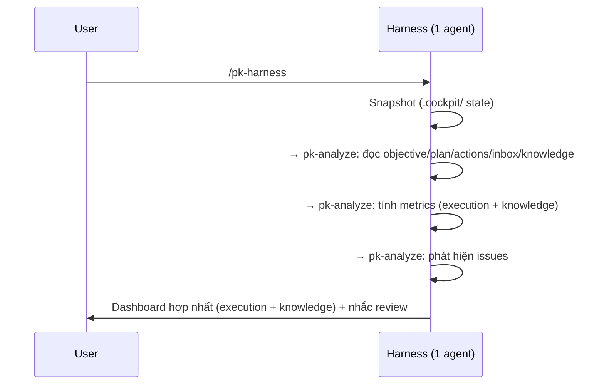

## 2. Track light flow

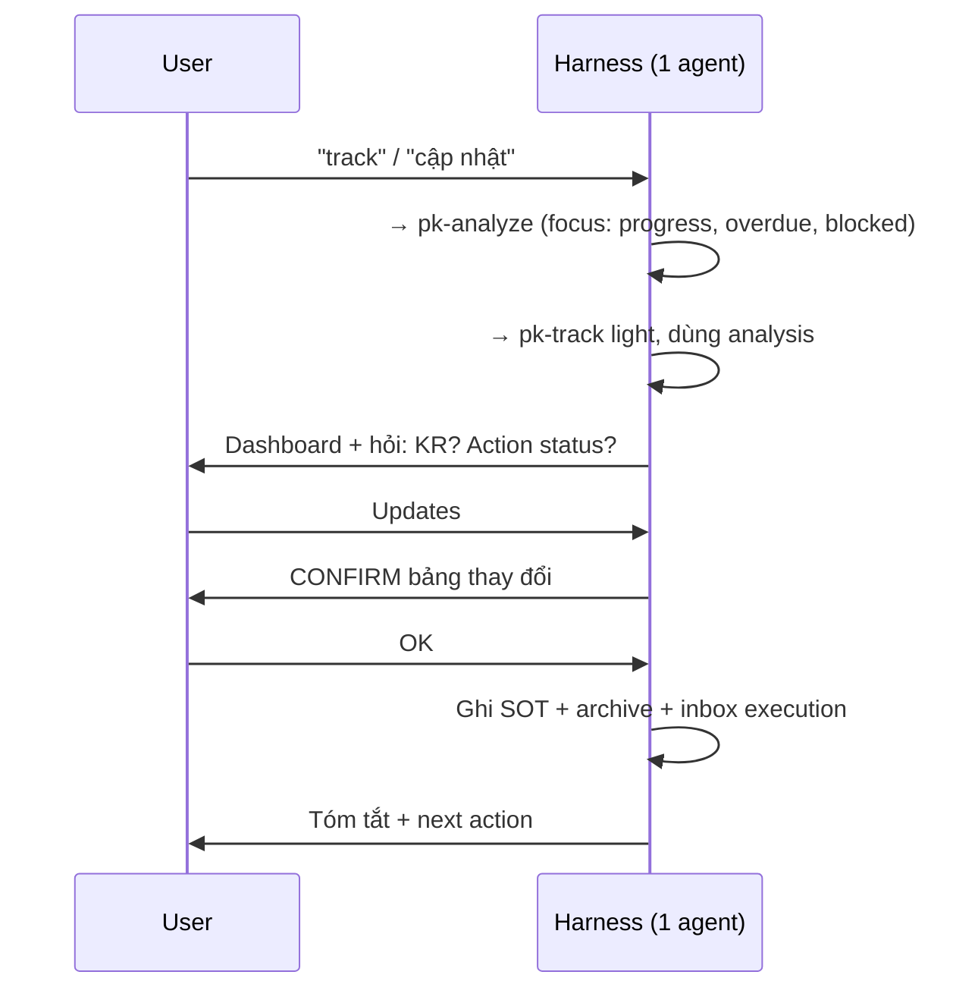

## 3. Deep review flow

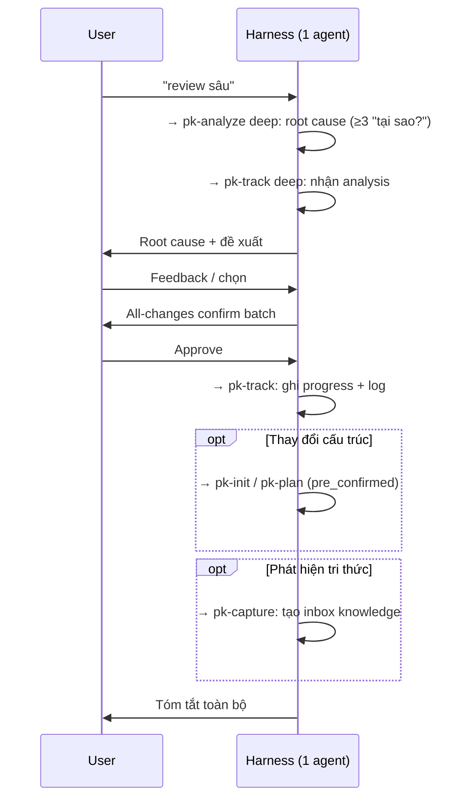

## 4. Capture flow

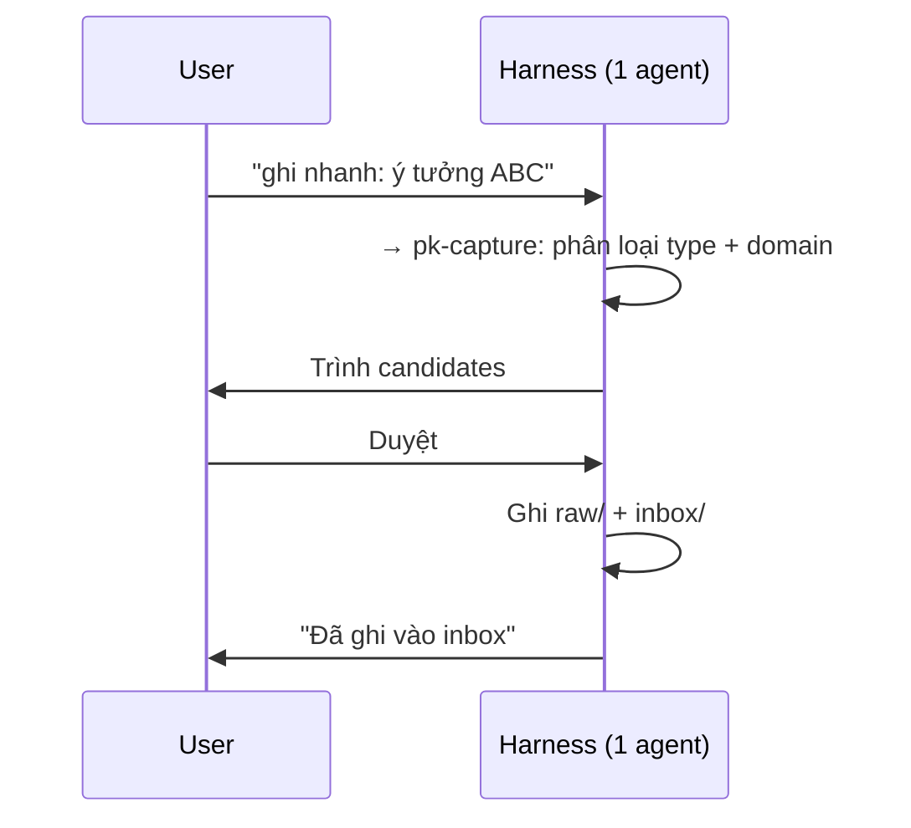

## 5. Knowledge distill flow

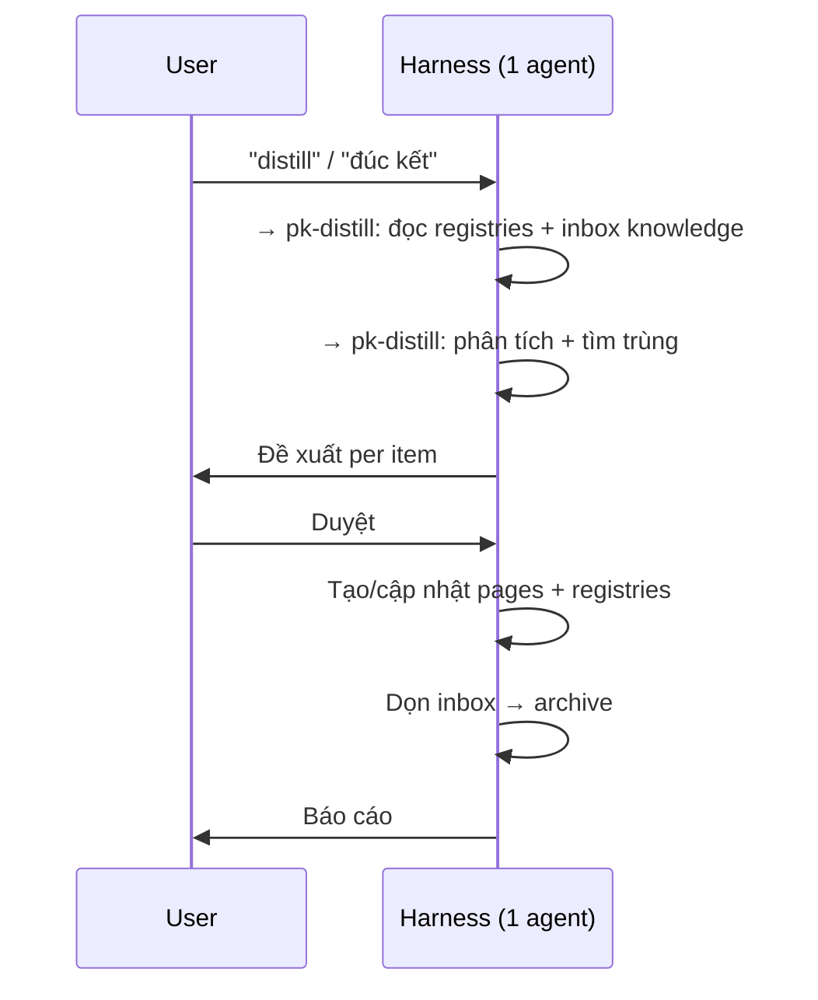

## 6. Consult flow (query)

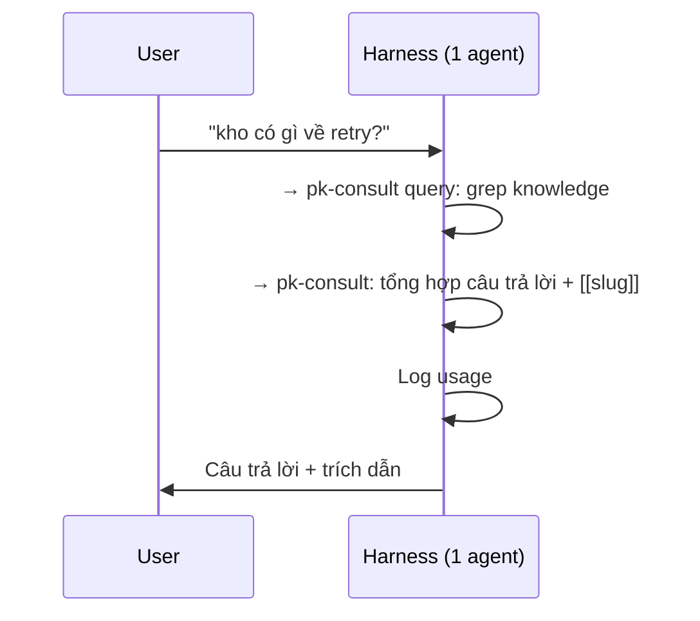

## 7. Consult flow (run)

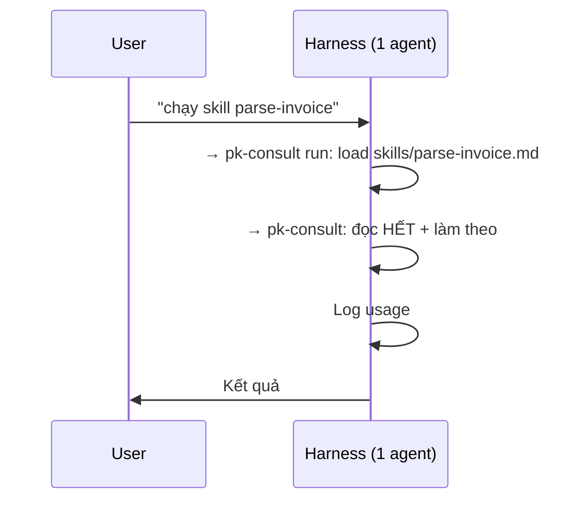

## 8. Reflect flow (light)

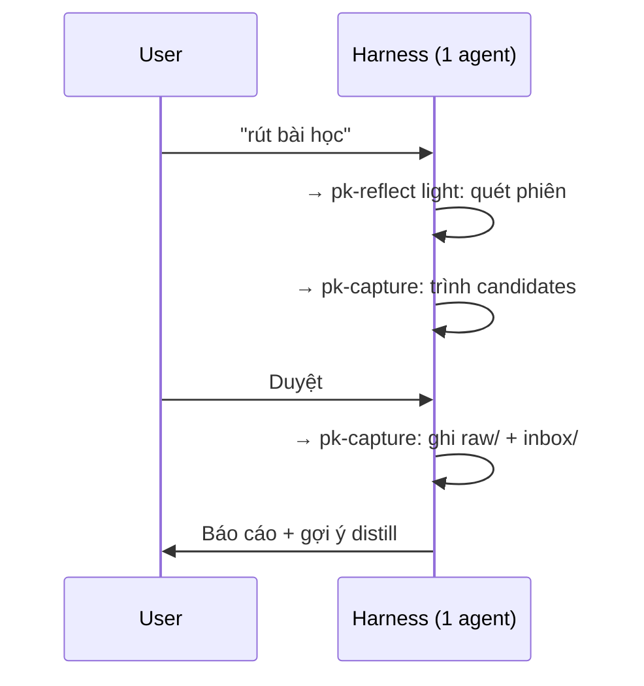

## 9. Reflect flow (deep AAR)

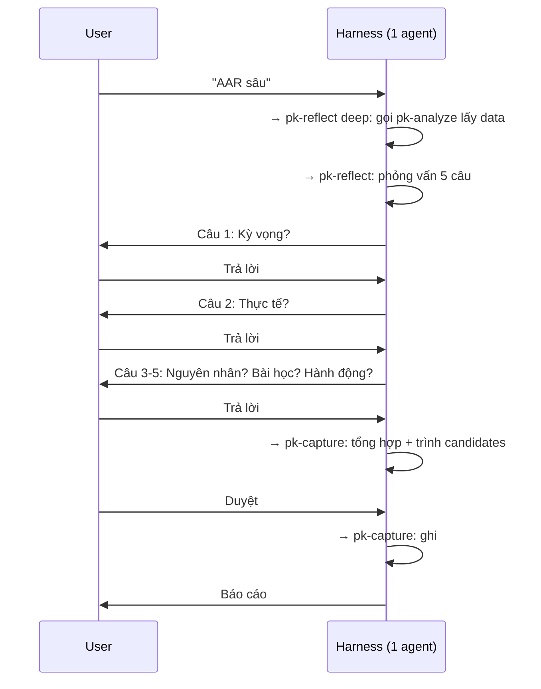

## 10. Lint flow

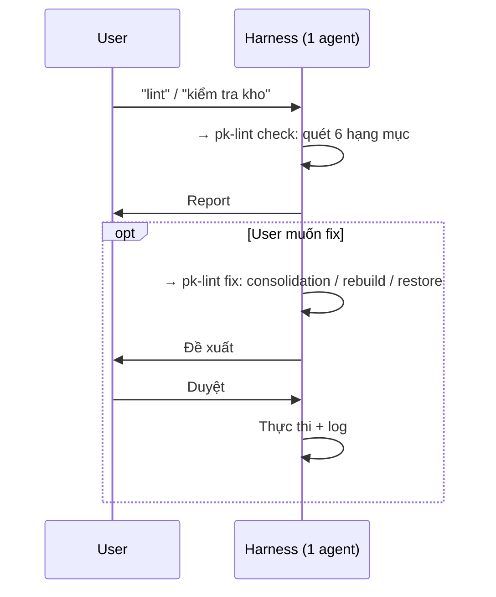

## 11. Inbox routing

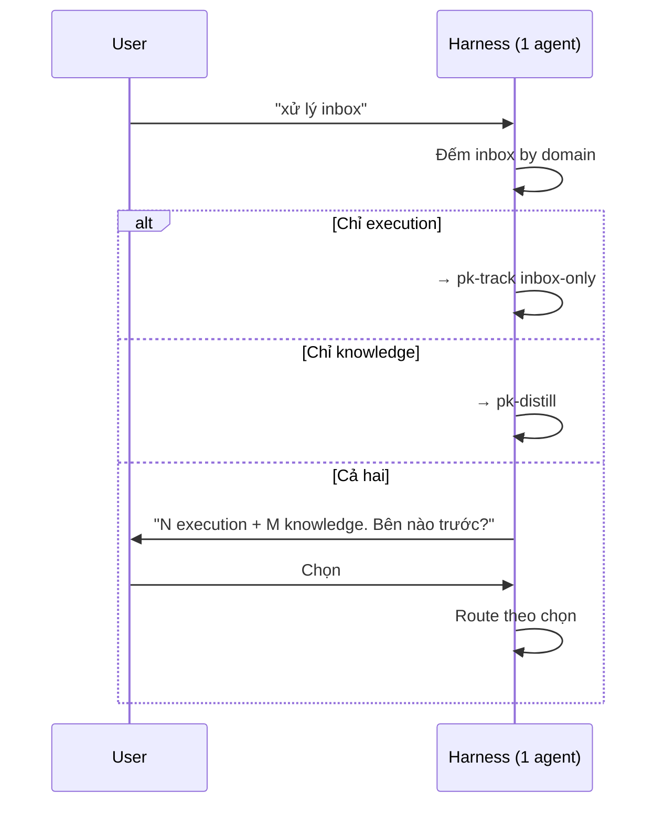

## 4 điểm tích hợp chính

### 1. Plan → Consult (tri thức hỗ trợ lập kế hoạch)

pk-plan (lớp 2) → pk-consult (lớp 3): tìm pattern, decision, troubleshooting liên quan khi tạo action.

### 2. Track → Capture (thực thi sinh tri thức)

pk-track deep (lớp 2) → pk-capture (lớp 3): pattern/lesson mới → inbox knowledge.

### 3. Reflect → Analyze (phân tích nuôi phản tư)

pk-reflect deep (lớp 2) → pk-analyze (lớp 4): metrics, trends → dữ liệu cho AAR.

### 4. Track → Consult (skill hỗ trợ tracking)

pk-track (lớp 2) → pk-consult run (lớp 3): action có skill liên quan → thực thi.
```

- [ ] **Step 2: Verify and commit**

```bash
head -5 skills/pk-harness/references/flows.md && git add skills/pk-harness/references/flows.md && git commit -m "feat(pk-harness): add detailed flow diagrams with Mermaid"
```

---

### Task 14: Cross-reference validation

**Files:**
- Read: All 17 files created above

- [ ] **Step 1: Verify all files exist**

```bash
echo "=== pk-shared references ===" && ls skills/pk-shared/references/
echo "=== SKILL.md files ===" && find skills -name "SKILL.md" | sort
echo "=== flows.md ===" && ls skills/pk-harness/references/flows.md
echo "=== Total files ===" && find skills -name "*.md" | wc -l
```

Expected: 6 reference files + 10 SKILL.md + 1 flows.md = 17 files.

- [ ] **Step 2: Verify all skill names in frontmatter**

```bash
grep -h "^name:" skills/*/SKILL.md | sort
```

Expected: pk-analyze, pk-capture, pk-consult, pk-distill, pk-harness, pk-init, pk-lint, pk-plan, pk-reflect, pk-track (10 skills).

- [ ] **Step 3: Verify cross-references are consistent**

Check all `../pk-shared/references/` links exist:
```bash
grep -rh "\.\./pk-shared/references/" skills/*/SKILL.md | grep -oP 'references/[a-z-]+\.md' | sort -u
```

Expected: references to snapshot-contract.md, sot-ownership.md, cross-call-rules.md, quality-gate.md, metrics.md, schemas.md (all 6 exist).

- [ ] **Step 4: Verify SOT ownership consistency**

Compare skill names mentioned in sot-ownership.md with actual SKILL.md files:
```bash
grep -oP 'pk-[a-z]+' skills/pk-shared/references/sot-ownership.md | sort -u
```

Expected: pk-capture, pk-consult, pk-distill, pk-init, pk-lint, pk-plan, pk-reflect, pk-track (8 skills that write, excluding pk-analyze and pk-harness which are read-only/orchestrator).

- [ ] **Step 5: Verify cross-call layer consistency**

Check cross-call-rules.md layers match SKILL.md references:
```bash
grep "cross-call" skills/*/SKILL.md
```

- [ ] **Step 6: Final commit**

```bash
git add -A skills/
git status
git commit -m "feat: complete Project Cockpit skill definitions (17 files)

10 SKILL.md files + 1 flows.md + 6 pk-shared references.
Merges okr-* (8 skills) + knowhow-* (7 skills) into pk-* (11 skills).
Per-project .cockpit/ directory with unified inbox and knowledge engine."
```

---

### Task 15: Installation setup

**Files:**
- Modify: Project CLAUDE.md or equivalent

- [ ] **Step 1: Check if installation instructions are needed**

```bash
cat CLAUDE.md 2>/dev/null || echo "No CLAUDE.md found"
```

- [ ] **Step 2: Create installation notes**

Add a note in the project about how to install the skills:

```bash
echo "Skills are in skills/pk-*/. To install, symlink or copy to ~/.agents/skills/pk-*/." 
```

The actual installation (symlinking to `~/.agents/skills/`) is a separate manual step. The old okr-* and knowhow-* skills should be disabled/renamed after migration to avoid conflicts.

- [ ] **Step 3: Verify final state**

```bash
find skills -name "*.md" -exec echo {} \; | sort
echo "---"
echo "Total files:"
find skills -name "*.md" | wc -l
```

Expected: 17 files total.
