# Data Flows chi tiết (skill-only inline)

Toàn bộ luồng do **một agent** thực thi: orchestrator đọc state, rồi đọc tiếp SKILL.md phù hợp và chạy theo flow. "→ skill X" = cùng agent đọc và thực thi skill X, không spawn sub-agent.

## 1. Dashboard flow

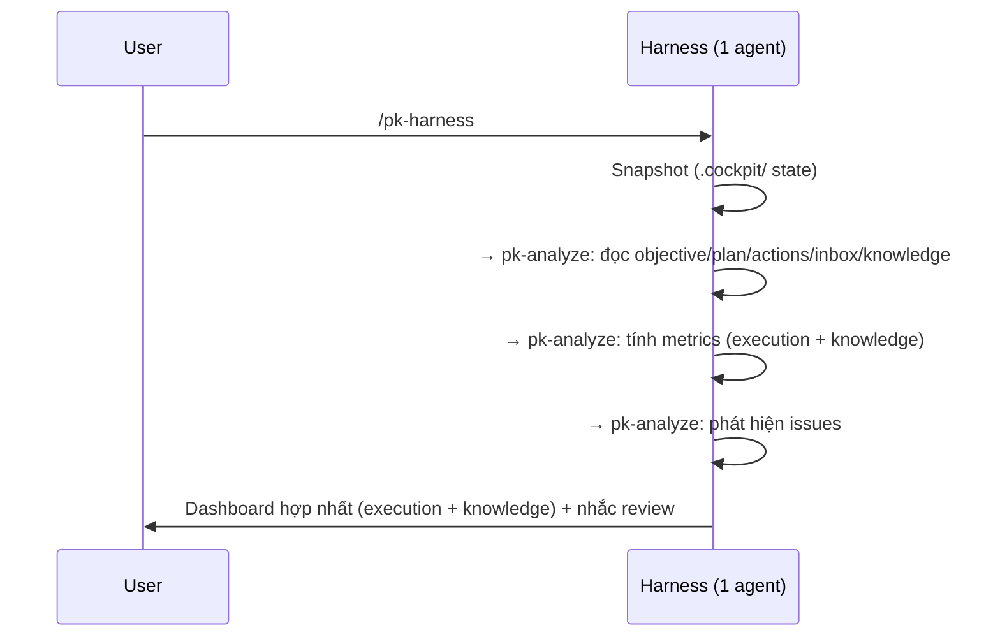

## 2. Track light flow

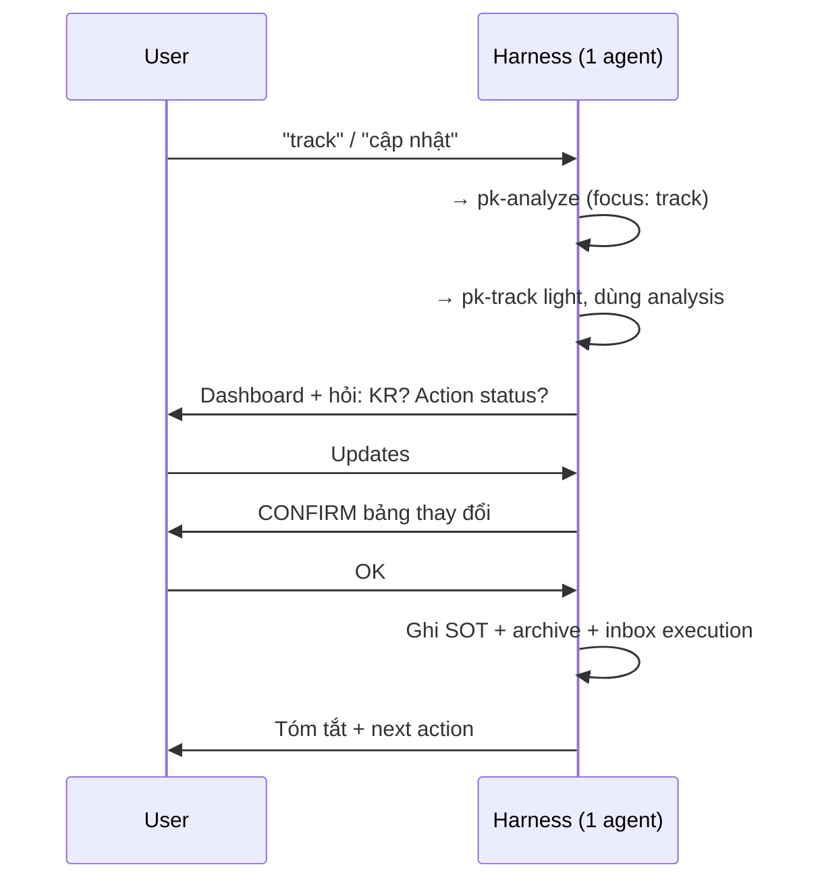

## 3. Deep review flow

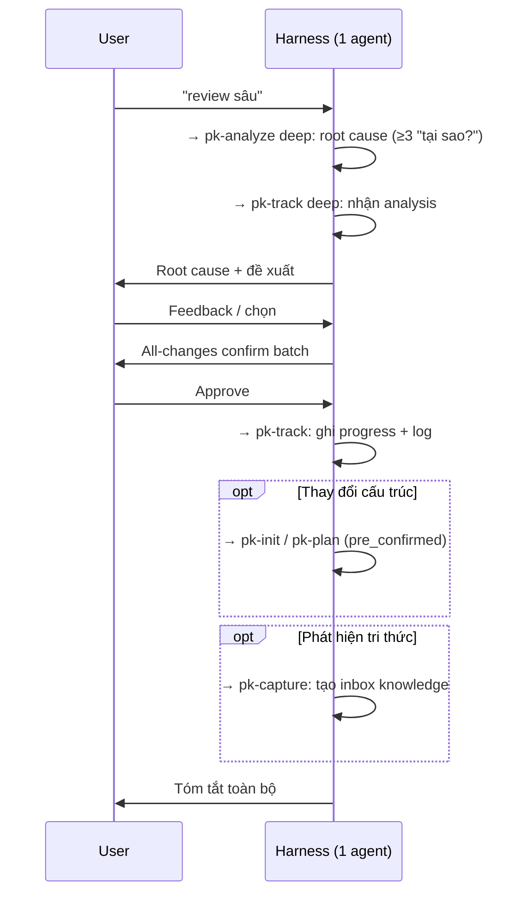

## 4. Capture flow

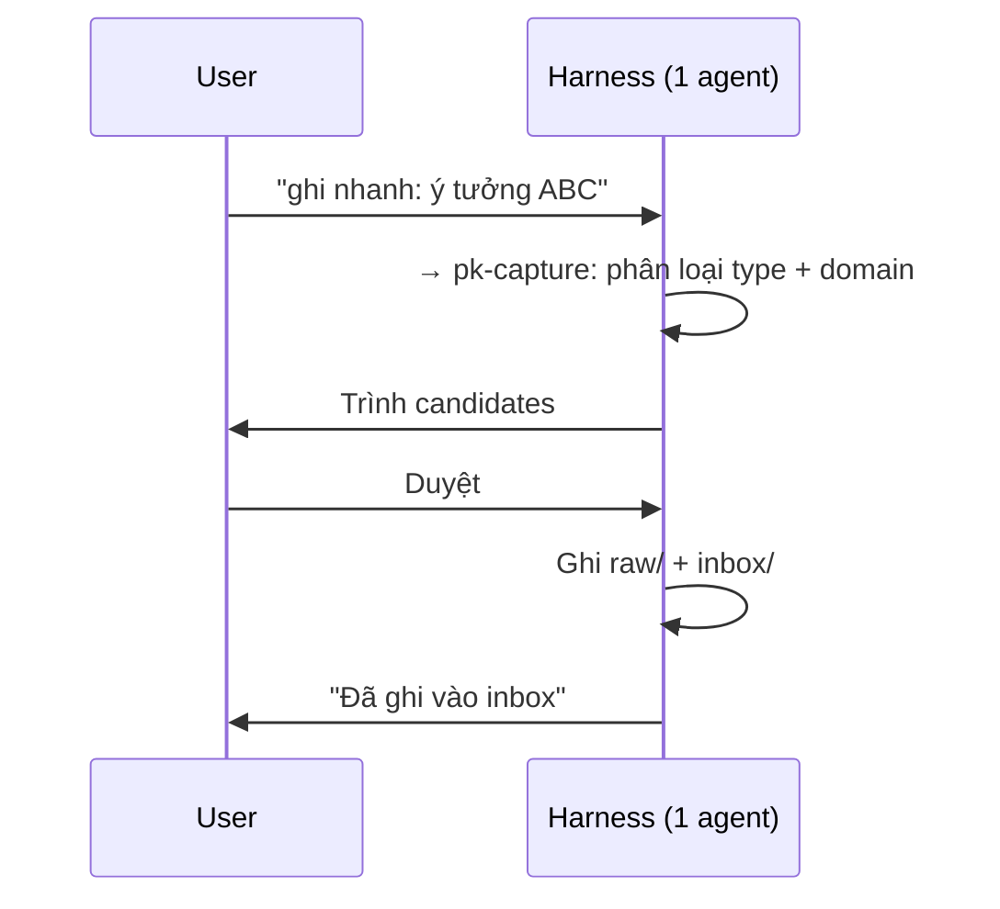

## 5. Knowledge distill flow

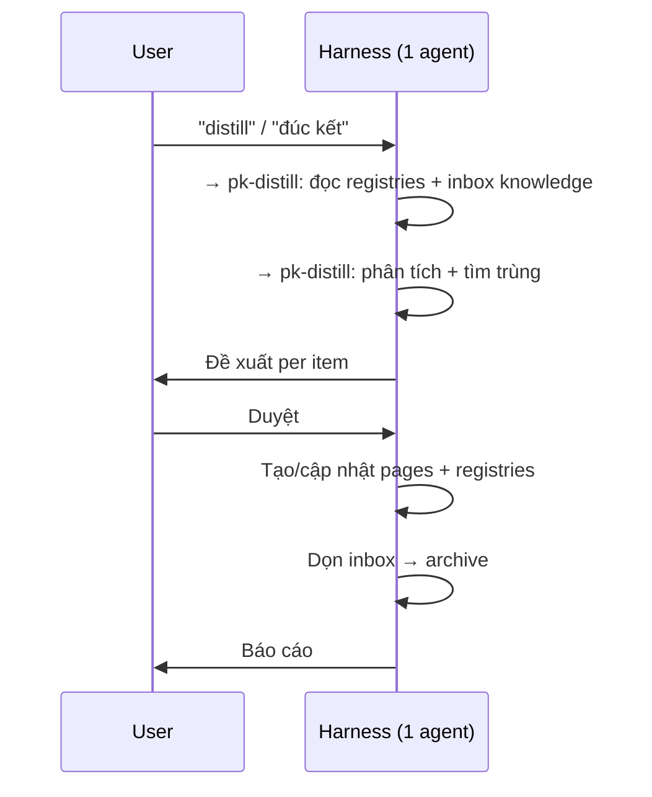

## 6. Consult flow (query)

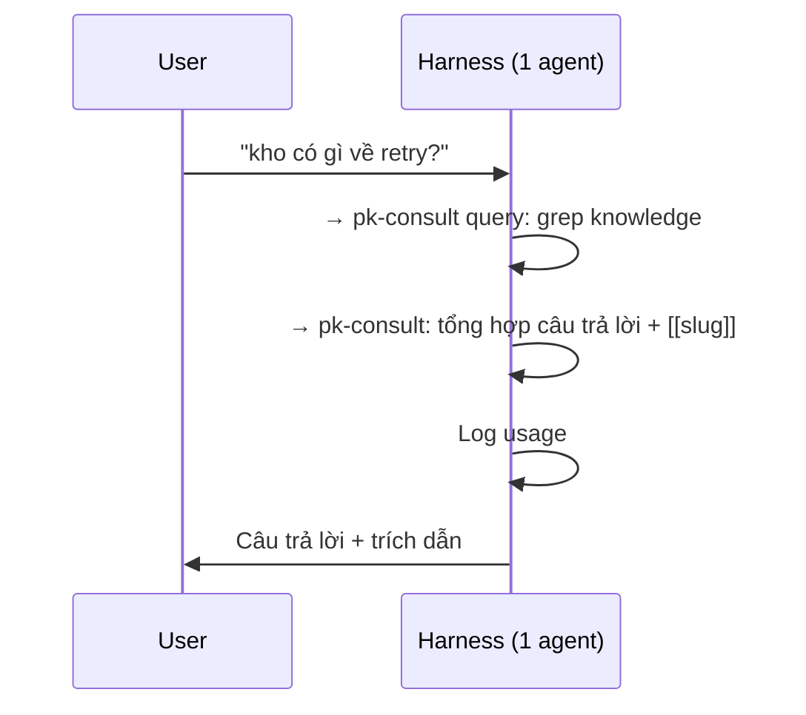

## 7. Consult flow (run)

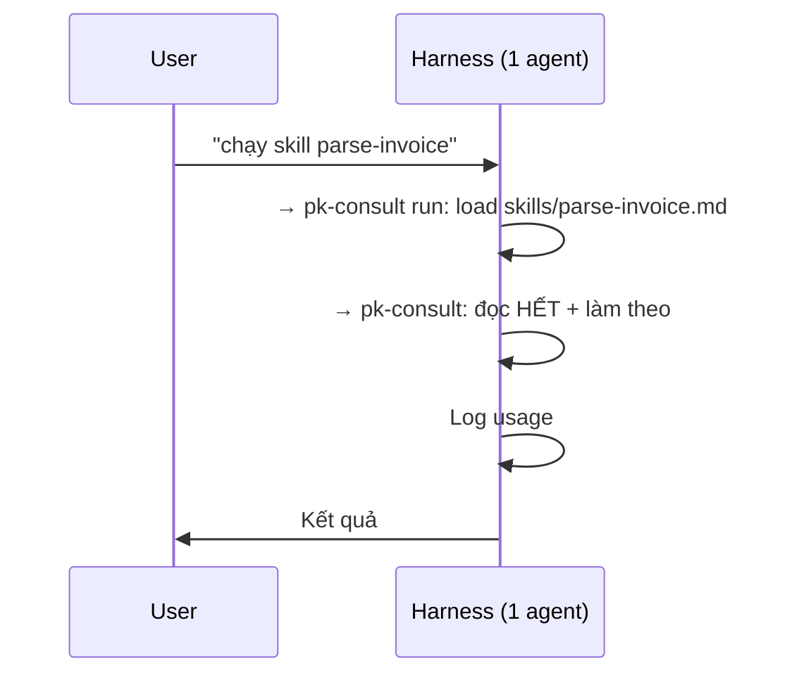

## 8. Consult flow (teach)

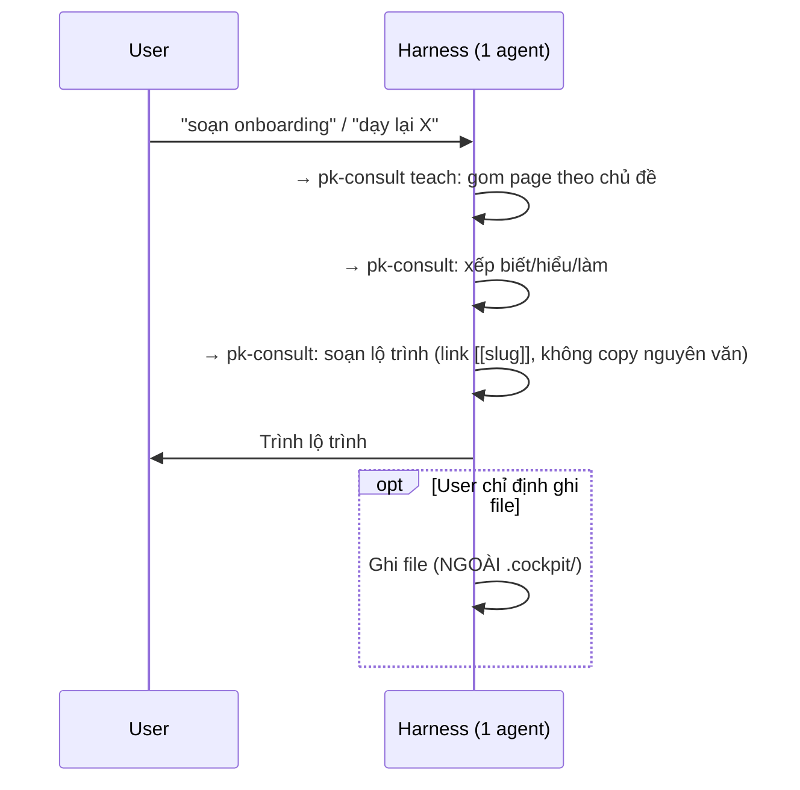

## 10. Reflect flow (light)

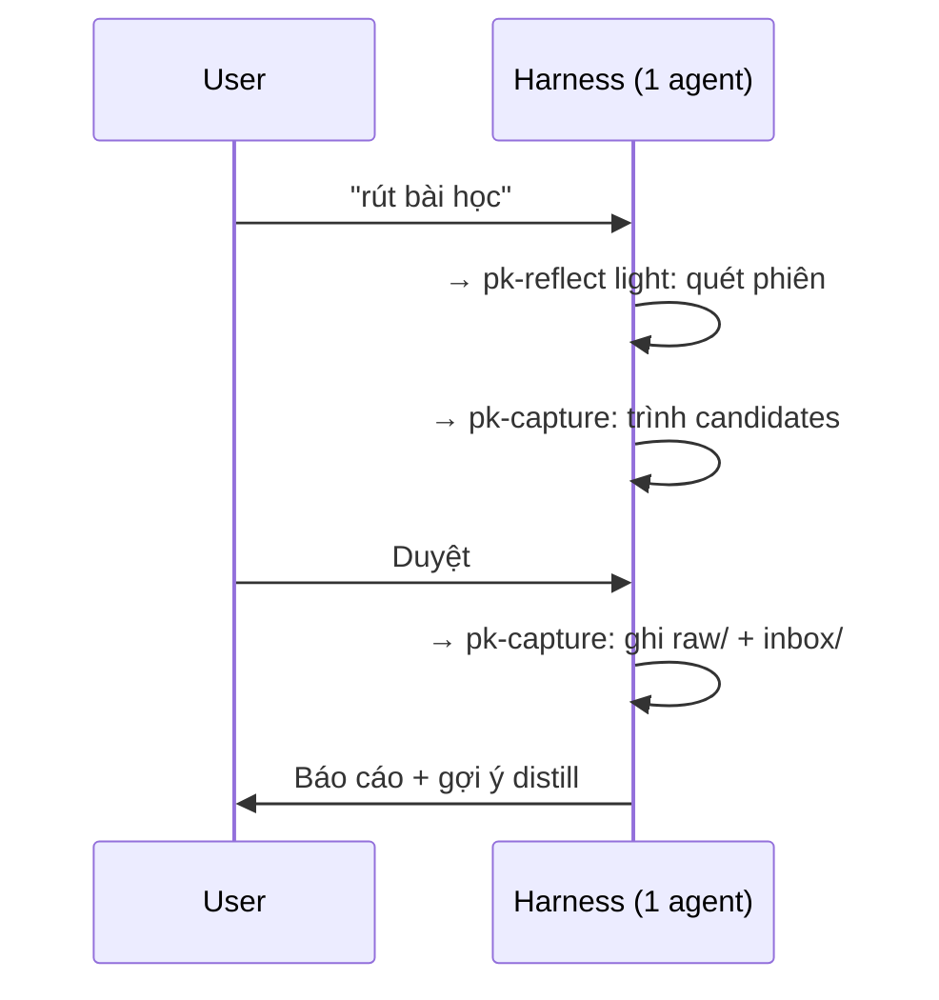

## 9. Reflect flow (deep AAR)

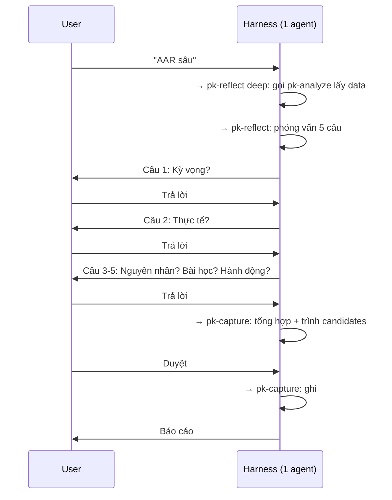

## 11. Lint flow

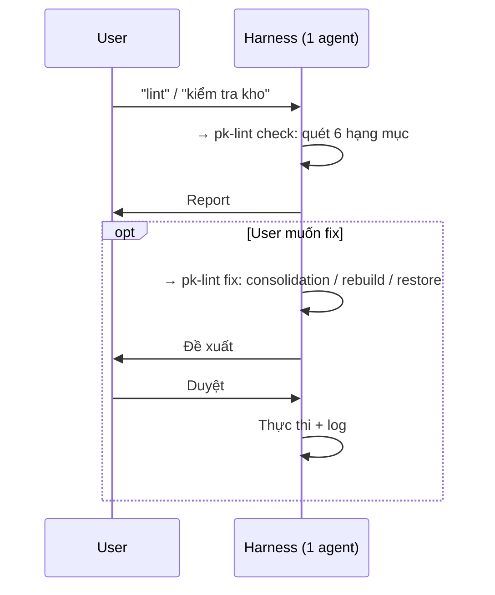

## 12. Inbox routing

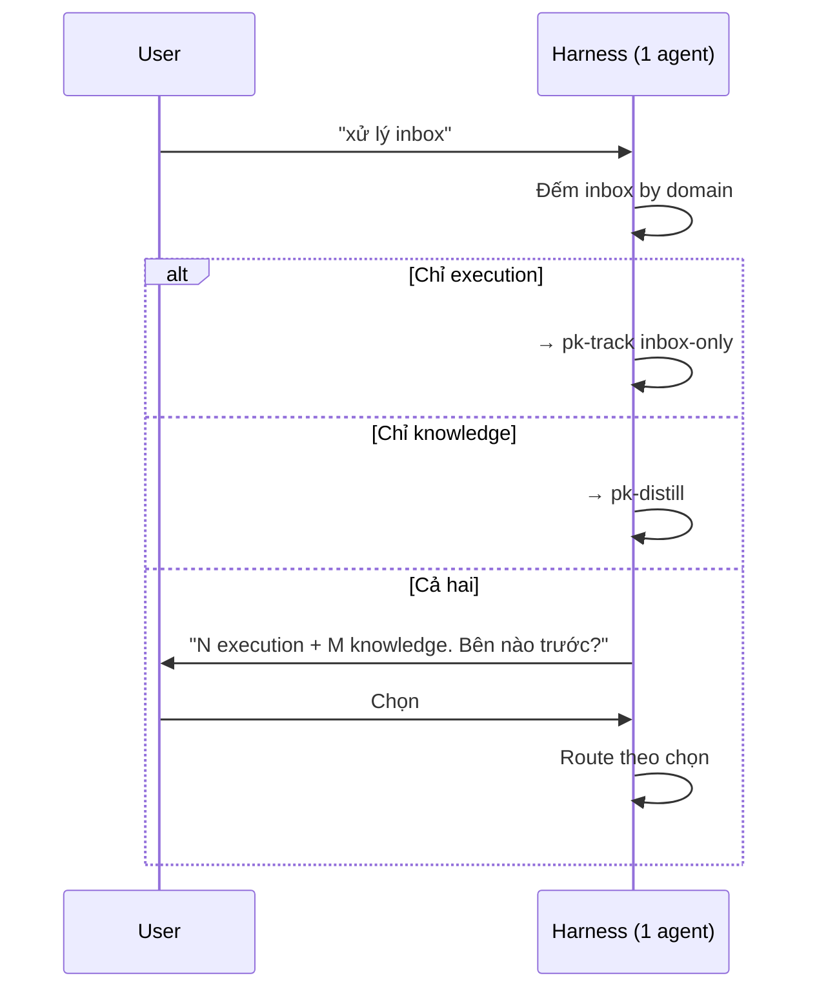

## 4 điểm tích hợp chính

4 điểm tích hợp dưới đây là **bản phái sinh** từ `../../pk-shared/references/cross-call-rules.md` (canonical bảng cross-call hợp lệ). Khi lệch, cross-call-rules.md thắng.

### 1. Plan → Consult (tri thức hỗ trợ lập kế hoạch)

pk-plan (lớp 2) → pk-consult (lớp 3): tìm pattern, decision, troubleshooting liên quan khi tạo action.

### 2. Track → Capture (thực thi sinh tri thức)

pk-track deep (lớp 2) → pk-capture (lớp 3): pattern/lesson mới → inbox knowledge.

### 3. Reflect → Analyze (phân tích nuôi phản tư)

pk-reflect deep (lớp 2) → pk-analyze (lớp 4): metrics, trends → dữ liệu cho AAR.

### 4. Track → Consult (skill hỗ trợ tracking)

pk-track (lớp 2) → pk-consult run (lớp 3): action có skill liên quan → thực thi.
